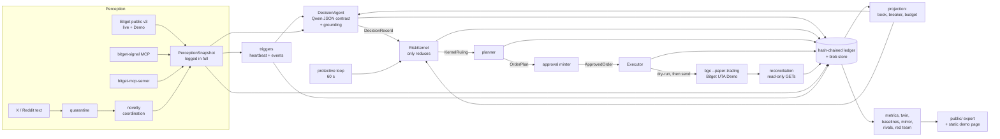

# DESIGN — t2-sentiment-agent

A Market Sentiment Agent for Bitget AI Base Camp S2, Track 2 (Agentic Trading). Qwen `qwen3.8-max`
is the only thing that decides what to trade. A risk kernel that can only reduce stands between the
decision and the venue. Bitget's own Agent Hub CLI (`bgc --paper-trading`) places every order on
Bitget UTA Demo. Every input, decision, ruling, order and fill is written to one hash-chained log,
and everything a judge reads is computed from that log.

**Status.** Pre-genesis. No order has been placed and no Qwen call has been made. The contract
(`src/sentiment_agent/types.py`, `policy.py`, `hashing.py`, `clock.py`) and the test harness are
built and pass `ruff`, `mypy --strict` and 102 contract tests (`tests/contract/`), including one
that reads every policy number back from the evidence in `validation/` (§18, M0). The other modules
below are specified and being built against that contract.

Working name `t2-sentiment-agent` until the owner names it. Python package `sentiment_agent`.

The *win plan* referred to below is the planning document that chose this design. It is not part
of this repository; every measurement it contributed is reproduced, with its script, in
`validation/`.

---

## Contents

1. What the handbook asks, and what answers it
2. Hard safety rules, and where each is enforced
3. Measured facts this design rests on
4. Architecture and data flow
5. Run modes
6. Perception
7. The snapshot log and the blob store
8. Heartbeat and event triggers
9. The decision
10. The risk kernel
11. Execution through Agent Hub
12. The ledger
13. Book, equity and marks
14. The judged half
15. Metric definitions and the expected envelope
16. Sequencing around the one clock
17. File layout
18. Modules
19. Where this design departs from the win plan, and why
20. NOT VERIFIED, and how each item gets pinned
21. What only the owner can do
22. Independence and attribution
23. Coverage against the owner's directives of 2026-09-24
24. Run 2: what changes against run 1, and what does not

---

## 1. What the handbook asks, and what answers it

Source: the Bitget AI Base Camp S2 handbook (English), Track 2 section; `handbook:N` is a line of
that text as captured in September 2026.

| Handbook line | Requirement | Answered by |
|---|---|---|
| :224 | "The LLM is the primary trading decision-maker… sense the environment, make independent judgments, and autonomously place orders with risk controls" | Qwen proposes every target (§9); the kernel only reduces (§10); nothing deterministic ever adds exposure |
| :226 | "Runnable Demo + demonstrate a complete event → decision → execution flow (simulated or paper trading acceptable)" | `t2sa replay` re-runs any recorded cycle keylessly (§14.6); the static demo page walks each cycle (§14.7) |
| :233 | Market Sentiment Agent: "FOMO detection → contrarian hedge; sentiment top detection; reduce before overheating" | Crowding features per instrument (§6.3); the model is asked for "what the crowd believes vs what we do" (§9.3); the kernel's reductions are visible per guard (§10) |
| :245 | "Paper trading log (actually run during competition period)" | The PAPER ledger, exported to `public/ledger.jsonl` (§12) |
| :248 | "Paper trading Sharpe, max drawdown, win rate; decision explainability; Agent architecture quality; risk control layer effectiveness" | §15 metrics with a recompute script; decision cards (§14.1); this document and the typed contract; the governed/ungoverned twin, guard funnel and red team (§14.2, §14.5) |
| :250 | "50% quantitative + 50% judge scoring" | The quantitative half is reported honestly against a pre-registered envelope (§15.2); the judged half is built at full depth |
| :396 | Perception layer: `bitget-signal` + `bitget-mcp-server`; execution layer: Agent Hub | §6 and §11 |
| :422, :444 | "`--paper-trading` to route to Bitget's Demo environment … produces exactly the paper-trading logs required", "any write can be previewed with `dryRun`" | Every order is previewed with `--dry-run` and then sent with `--paper-trading` (§11) |

---

## 2. Hard safety rules, and where each is enforced

| Rule | Enforcement in code | Test that fails if it is broken |
|---|---|---|
| Orders go only to Bitget Demo | `execution/bgc.py`: the argv builder appends `--paper-trading` as a constant; there is no parameter to remove it. The only argv without it is the environment proof's live-negative read, which carries `--read-only` so `bgc` refuses any write structurally (`agent-sdk/src/tools/safety.ts:90-95`) | `tests/execution/test_bgc.py`: every argv the transport can build contains `--paper-trading` and never `--read-only`; `tests/execution/test_environment.py`: the one non-paper argv contains `--read-only` and a read verb |
| Verify the environment before any order; 40099 or any sign of live refuses and exits | `execution/environment.py` builds an `EnvironmentProof` (§11.2). `EnvironmentProof.passed` cannot be constructed `True` unless every check passed (`types.py`, validator). The executor refuses to send without a passed proof in the PAPER ledger; a 40099 anywhere raises `EnvironmentRefused` and the runtime exits with code 3 | `tests/contract/test_contract.py::test_environment_proof_cannot_pass_unearned`; `tests/execution/test_environment.py`; `tests/runtime/test_refusals.py` |
| Refuse to start unless the key is marked Demo | `.secrets/demo.env` must contain `BITGET_KEY_ENVIRONMENT=demo`; `load_demo_credentials` refuses otherwise | `tests/execution/test_environment.py` |
| Never read the owner's live-key file, which lives outside this repository | Credentials are read from exactly one path, `<project root>/.secrets/demo.env`, resolved and required to sit inside the project root. Inherited `BITGET_*` variables are stripped from the child environment, so a live key in the parent shell cannot reach `bgc` | `tests/contract/test_contract.py::test_live_key_file_is_never_referenced_in_source`; `tests/execution/test_environment.py` (path outside root refused; parent env stripped) |
| Until the Demo key exists, run dryRun / simulated end to end | Run modes SIMULATED and DRYRUN read no credential at all (§5) | `tests/runtime/test_e2e_simulated.py` |
| Never call Qwen in tests | `tests/conftest.py` blocks every non-loopback socket and every child process except a Python interpreter (a `node`, `curl` or CLI child would be a network door the socket guard cannot see); the agent takes a `ChatModel` and tests pass `llm/fakes.py` stand-ins | `tests/contract/test_contract.py::test_network_is_blocked`; `tests/contract/test_invariants.py::test_child_processes_other_than_python_are_blocked` |
| Never place an order during the build | No command in the build path sends; `bgc` dry-run previews are local (`safety.ts:86-88` returns before any network call) | Build procedure, §16 |

---

## 3. Measured facts this design rests on

From the win plan's measurements, with scripts and outputs in `validation/demo_venue/`, plus reads
made for this design on 2026-09-24.

1. **UTA Demo freezes US-equity perps on weekends.** Weekend mean |1H move| of the Demo index is
   0.1-1.5 bps against 5.6-29.1 bps live; on weekdays Demo tracks live (18-66 bps).
   (`weekend_vol.json`)
2. **The Demo venue has bad instruments.** Mark-vs-index excursions over 3% in the last 30 days:
   XRP 252, DOGE 11, SOL 8, ETH 4, BTCUSDT 0, the 11 equity perps 0. (`demo_integrity.json`,
   `fade_demo.json`)
3. **Tradable universe:** BTCUSDT, SP500USDT, NDX100USDT and 11 US-equity perps (MSTR, HOOD, CRCL,
   SNDK, COIN, TSLA, GOOGL, META, NVDA, AMZN, AAPL), equities on weekdays only.
4. **Demo instrument limits and fees**, keyless `GET /api/v3/market/instruments` with
   `paptrading: 1`: taker fee 0.0006 and maker 0.0002 on all 14; e.g. NVDAUSDT `minOrderQty` 0.01,
   `quantityMultiplier` 0.01, `maxMarketOrderQty` 60, `maxLeverage` 25, `minOrderAmount` 5.
   Demo spreads 0.1-6.6 bps. (`universe_probe.json`) This settles the win plan's "UTA Demo taker
   fee: 6 bps assumed".
5. **Keyless public v3 market endpoints return Demo data when sent `paptrading: 1`**
   (tickers, instruments, history-candles of type market/mark/index, history-fund-rate). The SDK
   itself sends the header only on private calls (`agent-sdk/src/client/rest-client.ts:274-280`),
   because some public endpoints 404 under it; this project sends it only on the endpoints above.
6. **Signing and the paper header**, read in Bitget's SDK: HMAC-SHA256, base64, over
   `timestamp + METHOD + path?query + body` (`utils/signature.ts:3-5`, `rest-client.ts:284-290`);
   headers `ACCESS-KEY/SIGN/PASSPHRASE/TIMESTAMP`; `paptrading: 1` on private endpoints when
   `paperTrading` is set (`rest-client.ts:278-280`). This project never signs anything itself:
   `bgc` does.
7. **`dryRun` needs no credentials** by the SDK's code path: `executeWithSafety` returns the preview
   before the credential gate (`tools/safety.ts:83-88` vs `rest-client.ts:152-165`), and
   `loadConfig` accepts no credentials (`config.ts:191-205`). To be confirmed by running it (§20).
8. **Order read-back fields**, from Bitget's UTA docs (api-doc/uta/trade, fetched 2026-09-24):
   order detail has `orderId, clientOid, symbol, side, orderType, qty, cumExecQty, cumExecValue,
   avgPrice, orderStatus (live|new|partially_filled|filled|cancelled), reduceOnly, feeDetail[],
   delegateType, cancelReason, createdTime, updatedTime`; fills have `execId, orderId, clientOid,
   symbol, side, execPrice, execQty, execValue, tradeScope, tradeSide, feeDetail[], execPnl,
   createdTime`; `history-orders` and `fills` page by `cursor`, 100 rows, 30-day windows.
9. **Qwen wire facts** (ARGUS `llm/qwen.py`, verified live 2026-09-12): OpenAI-compatible
   `/chat/completions`; `response_format: json_object` works; `reasoning_content` is separate;
   FULL reasoning ~4.3k completion tokens and needs streaming (gateway closes unstreamed requests
   at ~120 s); LOW ~0.8k; `enable_thinking: false` and `reasoning_effort: "low"` are the spellings.
10. **`bitget-mcp-server`** (`https://agent.bitget.com/mcp`) answers keyless but returns 403 to
    Python's default User-Agent; `do_query` takes `entry_id`; replies are SSE-framed
    (ARGUS `market/bitget_mcp.py`). 37 of 67 entries answered on 2026-09-24, including both Fear &
    Greed entries and the crypto long/short and open-interest entries (ARGUS `data/data_coverage.json`).
11. **`bitget-signal`** MCP is `https://datahub.noxiaohao.com/mcp` (`bitget-signal/scripts/install.js:30`).
12. **The honest envelope.** A capped book with no edge over 72h at 25% gross: return median -8.6 bps
    (p05 -88, p95 +81), max drawdown median -0.42% (worst -2.48%), Sharpe median -2.3 (p05 -20,
    p95 +17), win rate median 45% (`envelope_clean.json`). Three-day Sharpe and win rate are luck;
    drawdown is what design controls.

---

## 4. Architecture and data flow



**Two properties carry the design.**

* **The model decides; nothing else adds exposure.** Every exposure-adding order traces to a
  `DecisionRecord` with `outcome == DECIDED`. The kernel, the protective loop, and every fallback
  can only shrink, refuse or close. This is enforced by types, not discipline:
  `InstrumentRuling` refuses construction if `|approved| > |reference|` or the side turns
  (`types.py`), and the executor accepts only an `ApprovedOrder`, which only `kernel/approval.py`
  can mint.
* **Everything a judge reads is computed from the log.** The ledger carries the full perception
  snapshot, the rendered prompt, the raw completion, the kernel's per-guard ruling, the dry-run
  payload, the venue's acknowledgement and fills, and the hourly marks. Cards, metrics, baselines,
  the twin, the mirror and the rival arms are all projections. Nothing needs to be re-fetched to
  check a claim, and the whole judged half can be built behind the running clock without touching
  it (win plan §3.3).

State is never held only in memory. On start, the runtime rebuilds the book, breaker, trigger
history, token budget and order states from the ledger (`book/projection.py`). A crash loses at
most the in-flight step, and an in-flight order becomes `UNKNOWN` and is resolved only by
reconciliation, never by resending.

---

## 5. Run modes

| Mode | Market data | Model | Orders | Credentials read | Ledger file |
|---|---|---|---|---|---|
| SIMULATED | keyless live + Demo | fake/recorded in tests; live Qwen only when the owner runs it | `SimulatedVenue`: taker fill at Demo ask/bid, 6 bps fee, stops on Demo mark | none | `var/ledger/simulated.jsonl` |
| DRYRUN | keyless live + Demo | as above | `bgc … --paper-trading --dry-run` preview only; nothing sent | none | `var/ledger/dryrun.jsonl` |
| PAPER | keyless live + Demo | live Qwen | `bgc … --paper-trading`, after the environment proof | `.secrets/demo.env`, `.secrets/qwen.env` | `var/ledger/paper.jsonl` |

Only the PAPER ledger is the submitted log. Modes never share a ledger file, and every event carries
its mode, so a simulated fill can never appear in the scored record.

---

## 6. Perception

### 6.1 The live/Demo rule

**Crowd positioning is read from live data; the venue is read from Demo.** Demo's funding and open
interest are sandbox settings, not a crowd (win plan §6: Demo SBTCSPERP funding fixed at -0.10% on
270 of 270 settlements; Demo BTCPERP funding at the +30 bps cap against ~0.5 bps live). A sentiment
agent that read Demo funding would be reading Bitget's configuration. So funding, open interest,
long/short ratios and the price context come from live; Demo supplies fills, marks, and the
venue-integrity comparison (G1).

### 6.2 Sources

| Surface | Call | Fields used | Cadence | Feeds |
|---|---|---|---|---|
| Public v3 (live) | `GET /api/v3/market/tickers` | last, mark, index, bid/ask, fundingRate, openInterest, price24hPcnt | 60 s protective, per snapshot | features, G1, mirror |
| Public v3 (Demo, `paptrading: 1`) | same | same | same | fills (simulated), G1, marks |
| Public v3 | `GET /api/v3/market/instruments` (live and Demo) | minOrderQty, quantityMultiplier, priceMultiplier, minOrderAmount, maxMarketOrderQty, taker/maker fee, status, fundInterval | at genesis, then daily | G11, planner, G7 |
| Public v3 | `GET /api/v3/market/history-candles` type market/mark/index, 1H | OHLC | per snapshot, hourly | MA/ATR features, stale-index detector, marks, arms |
| Public v3 | `GET /api/v3/market/history-fund-rate` (live) | fundingRate history | per snapshot | funding z-score, trigger |
| bitget-signal | `sentiment_index` current/history | Fear & Greed | per snapshot | mood, trigger |
| bitget-signal | `derivatives_sentiment` long_short, top_ls, taker_ratio, open_interest (BTCUSDT) | ratios, OI series | per snapshot | features, OI trigger |
| bitget-signal | `derivatives_sentiment` reddit_trending; `news_feed` | text | full snapshots | crowd text |
| bitget-mcp-server | `do_query` `crypto_sentiment_crypto_fear_greed`, `sentiment_market_fear_greed` | F&G crypto and equity-market | per snapshot | mood, source agreement |
| bitget-mcp-server | `crypto_futures_long_short_ratio`, `_top_account_ratio`, `_top_position_ratio`, `crypto_futures_open_interest_history`, `crypto_futures_funding_rate` | ratios, OI history | per snapshot | cross-check of bitget-signal; OI threshold history |
| bitget-mcp-server | `equity_calendar`, `equity_ownership_insider_trading` (underlying ticker) | earnings dates, Form 4 rows | full snapshots | calendar, earnings and filing triggers |
| X (twitter-cli) | cashtag search per universe name | posts | full snapshots | crowd text (optional layer) |
| Reddit (rdt-cli) | r/wallstreetbets, r/stocks, r/CryptoCurrency, per-ticker search | posts | full snapshots | crowd text (optional layer) |

Every call produces a `SourceCall` (surface, source, params, health, latency, rows, raw blob). A
failed or hollow source degrades the snapshot, never crashes it; the snapshot says which sources
answered, the model is told, and the card shows it. Since run 2 a failing source is also an
alarm (`perception/feeds.py`, §24): a `feed_health` ledger event when it starts or stops failing,
on the decision card, on the public page and in the health file, with every trigger kind it
leaves unable to fire named per instrument. Positioning data is the backbone; X and Reddit
are optional, because an unattended window cannot depend on a logged-in session (win plan §3.2).

### 6.3 Features per instrument

`PositioningFeatures` (`types.py`): live funding and its z-score over 90 settlements; open interest
and its 1h/24h change; retail and top-trader long/short ratios and taker ratio (BTC; the equity
perps have no such series and carry `None`); 24h change; distance of the live close from its 20-bar
1H mean in 14-bar ATR units (overheating); distinct-story social mentions and velocity; whether a
coordinated cluster names the instrument; Demo mark-index gap, Demo-live gap, Demo spread; the Demo
index's mean |1H move| over 3h (staleness); next earnings date.

`facts` is the flat map of every number rendered to the model. It is the grounding reference (G9)
and is logged with the snapshot.

### 6.4 Untrusted text

Every text item is written by somebody else. It passes `crowd/quarantine.py` (ported from ARGUS,
measured against AgentDojo's own attacks: structural frame-injection, model-address and
tool-directive patterns, a distance-1 override matcher, narrowed smuggled-character rules). Hostile
items are replaced by a redaction marker; flagged items survive with the finding recorded. Survivors
are wrapped in spotlight markers and the standing instruction sits in the system message.
`crowd/novelty.py` then clusters near-duplicates (4-word shingles, Jaccard 0.55) and marks a
cluster *coordinated* when 3 or more distinct sources carry it inside 2 hours. The model sees
distinct stories, not raw counts, and sees which clusters are coordinated.

---

## 7. The snapshot log and the blob store

A `PerceptionSnapshot` is logged in full as a `SNAPSHOT` event before any decision uses it.
`snapshot_id` is the content hash of the snapshot with the id blank, so the id proves the content.
Raw API responses, rendered prompts and raw completions are stored once, content-addressed, in
`var/blobs/<sha256>` and referenced by `BlobRef` from the events that used them. The chain commits
to each blob's hash, so a changed blob is detected by `verify`. The export publishes every
referenced blob.

Light snapshots (every 5 minutes, for trigger evaluation) carry quotes, funding, F&G and the
positioning ratios; full snapshots (every decision) add crowd text, news and the calendar. Both are
logged. Each is evaluated for the trigger kinds whose inputs it carries (§8): light snapshots for
Fear & Greed, funding and open interest, full snapshots for coordinated clusters, earnings and
filings. Run 1 evaluated light snapshots only, so the last three could not fire (§24).

---

## 8. Heartbeat and event triggers

All thresholds are fixed in `policy.py` (`TriggerRule`) and frozen at genesis.

| Trigger | Fires when | Basis |
|---|---|---|
| `heartbeat_us_open` | 09:30 America/New_York on weekdays (13:30 UTC in summer time; DST-correct through `zoneinfo` + `tzdata`) | win plan §3.2 |
| `heartbeat_funding` | 00:00, 08:00, 16:00 UTC (live BTCUSDT settles every 8h; re-read from `fundInterval` at genesis) | win plan §3.2 |
| `fear_greed_extreme` | crypto or equity-market F&G crosses into ≤25 or ≥76, or back out | Bitget's own bands, `bitget-signal/skills/sentiment-analyst/SKILL.md` |
| `funding_zscore` | live funding z-score beyond ±2 against the last 90 settlements, for every instrument in `policy.triggers.funding_z_asset_classes`: BTCUSDT under policy v1, the whole universe under policy v2 (run 2, §24) | win plan §3.2; run 1 replay (`validation/run2/`) |
| `open_interest_jump` | the absolute 1h change in open interest above the 99th percentile of the trailing 30 days (threshold computed at genesis from `crypto_futures_open_interest_history`, frozen) | win plan §3.2 |
| `coordinated_cluster` | a coordinated cluster (§6.4) names a universe instrument | win plan §3.2; ARGUS `novelty.py` |
| `earnings_event` | a held or candidate equity has an earnings date in the next 24h | win plan §3.2 |
| `filing_event` | a new Form 4 / 8-K row for a held equity since the last check | win plan §3.2 |
| `owner_manual` | the owner runs `t2sa decide --reason …` | logged and published as a human intervention |

Admission: one fire per (kind, instrument) per 240 minutes; at most 8 event decisions per UTC day;
heartbeats always admitted. Every evaluated trigger is logged, admitted or not, so a reader can see
what the agent chose not to wake up for.

**Where each kind is evaluated (run 2).** `fear_greed_extreme`, `funding_zscore` and
`open_interest_jump` on every light snapshot; `coordinated_cluster`, `earnings_event` and
`filing_event` on every full snapshot, the only snapshots that read crowd text and the calendar
(§7). No kind is evaluated on both, so one condition is never emitted twice. When the candidates
of a tick will start a decision (`TriggerEngine.preview`), the runtime takes the full snapshot
first, evaluates the full-snapshot kinds on it and admits everything in one batch: those events
join the decision they were seen on, under the same cooldowns and the same daily-cap rule (a batch
carried by a heartbeat counts nothing), instead of waking a second decision minutes later. This is
the reading of §6.2, §7 and this section that keeps the pre-registered cadences; the alternative,
reading crowd text and the calendar on light snapshots at some bounded cadence, would add a
collection cadence the design never registered and a dependency of the unattended loop on logged-in
X and Reddit sessions, which §6.2 keeps optional. Its consequence is stated rather than hidden: a
coordinated cluster is seen only at a decision, so it can shape a decision but not start one. Protective conditions (stops, kill switch, weekend freeze,
venue integrity) are not triggers for the model; the kernel handles them on its own clock (§10.5).

---

## 9. The decision

### 9.1 One decision covers the whole book

Each admitted trigger set starts one decision cycle over all eligible instruments: full snapshot,
book state from the ledger, mandate, then one Qwen call. Heartbeats use FULL reasoning (streamed);
event decisions use LOW. A daily token cap (2,400,000 by default, the owner's to approve) is
checked before every call. It is sized to the budget's own projection (one token per prompt byte
plus the completion cap) for the busiest day the trigger rules allow, prompt included: 4
heartbeats and 8 event decisions, each taking all three attempts at the completion ceiling, on the
recorded prompt (40,784 bytes) grown by 25% (`llm/budget.worst_case_day`, 2,333,328; the
arithmetic is in `policy.decision.basis` and `tests/llm/test_budget.py`). An event decision is
admitted only while the day's remaining tokens also carry every heartbeat still due before
00:00 UTC at its worst case (refused as `budget` otherwise), so the cap cannot refuse a heartbeat
and turn into an outage flatten. The prompt's source-coverage section names only sources that
failed; answering sources are a count.

### 9.2 Prompt

`decision/prompts/system_v1.md` (role, rules, the kernel's rules stated as facts the model cannot
change, the spotlight instruction, the output schema) and a user message rendered by
`decision/prompt.py`: the mandate, the book (positions, entry, P&L, time held, stops, rebalances
used today, time to the weekend freeze), the per-instrument feature table, mood, coordinated
clusters, spotlighted text, calendar, the source coverage list, and the triggers that woke it. The
prompt files are hashed into the genesis; changing one after genesis is an amendment.

### 9.3 Output contract (`LlmDecision`, `types.py`)

```json
{
  "stance": "act | hold | flat_with_reasons",
  "targets": [{
    "symbol": "NVDAUSDT", "target": -0.6,
    "thesis": "...", "invalidation": "...", "horizon_hours": 48,
    "crowd_belief": "...", "our_view": "...", "confidence": 0.55,
    "evidence": ["NVDAUSDT.funding_z_live", "x:1839..."],
    "invalidation_triggered": false, "invalidation_evidence": null
  }],
  "rejected_alternatives": [{"action": "long BTC", "reason": "..."}],
  "mandate_response": "deployed 8% of the 25% budget because ... / declined because ...",
  "flat_reasons": [],
  "summary": "..."
}
```

`target` is in [-1, 1] and the weight is `target × 5%`. Validation (`decision/contract.py`), each
failure fed back to the model with the specific complaint, up to 3 attempts: JSON parses; schema
holds; every held symbol is addressed; no symbol outside the universe; horizon ≥ 24h; truncation is
detected from `finish_reason` and retried with a larger cap, never repaired. A symbol not held and
not addressed has target 0.

### 9.4 Grounding

Every number in each target's thesis, invalidation and view is extracted and resolved against the
snapshot `facts` within 2% (`decision/grounding.py`, ported). The report is logged per symbol and
shown on the card. An ungrounded target may not add exposure (G9).

### 9.5 Outage

If a cycle cannot obtain a valid decision (timeout, transport error, invalid after 3 attempts, or
the daily cap reached), the `DecisionRecord` is logged with that outcome and no decision, and the
kernel flattens the book as a protective action (`llm_outage`). No deterministic rule ever opens a
position in its place (handbook:224). Recovery: the next valid decision returns the breaker to
active.

---

## 10. The risk kernel

### 10.1 The invariant

For every instrument, with `reference = proposed weight` (or the current weight when there is no
proposal): the approved weight has the sign of the reference or is zero, and its magnitude is at
most the reference's. The kernel can shrink or refuse what was asked and can close what is held; it
can never add exposure, keep exposure the model asked to cut, or turn a side.
`InstrumentRuling` refuses to be constructed otherwise, and so does a `NaN` or infinite weight
anywhere in the contract (`NaN` compares false both ways and would otherwise pass). A seeded sweep
test drives thousands of random books and proposals through `RiskKernel.rule` and asserts the
invariant on every output.

A ruling also cannot contradict its own explanation (`types.py`, checked on construction): a weight
the kernel changed names its `binding_guard`, and that guard shows a FIRED or NOT_EVALUATED ruling
for the instrument or at book level; the approved weight is within every ceiling reported for it,
and zero wherever a guard forces an exit (book-level rulings apply to every instrument); every
reported ruling belongs to a guard in `guards_applied`; a protective ruling carries no proposal.
So the card a judge reads (§14.1) is the ruling itself, never a narrative written beside it.

### 10.2 Evaluate-all, minimum-of-ceilings

Every applicable guard is evaluated on every ruling (none short-circuits), each contributes a
ceiling on |weight| or a forced exit, and the binding result is the minimum. This is ARGUS's
`ConstitutionPolicy.rule` restructure (`agents/desk.py:1093-1114`), which found that a
first-to-bind chain let a looser gate hide a tighter one. Each guard reports PASSED, FIRED,
NOT_EVALUATED (a missing input: fail-closed for any increase) or NOT_APPLICABLE, with its reason,
its inputs and its measured basis. There is no UNREACHED state, because nothing is skipped.

### 10.3 Guards

| Guard | Rule (policy v1) | Measured basis |
|---|---|---|
| G1 venue integrity | Refuse or exit when Demo mark departs >3% from Demo index, when the Demo-live price gap exceeds the instrument's measured p99, or when the Demo index has not moved (mean absolute 1H move over 3h < 2 bps) while its session should be open | §3.1-3.2; per-instrument p99 in `policy.UNIVERSE` |
| G2 weekend freeze | US-equity and US-index legs flat Fri 20:00 → Mon 00:00 UTC; pre-flatten from 19:45; no new equity exposure in the 2h before the freeze | §3.1; same window as `envelope_clean.py` |
| G3 size | ≤5% of equity per name, ≤25% gross | envelope worst DD -2.48% at 25% gross |
| G4 stop | every opening or increasing order carries a venue stop 4% from entry, triggered on mark | `envelope_clean.py`; a venue stop survives a crashed agent |
| G5 daily kill | book down 1.5% from 00:00 UTC equity flattens everything; halted until the next UTC day | `envelope_clean.py` |
| G6 turnover | ≤2 model-initiated orders per name per UTC day; no increase or flip within 24h of the last increase unless the model declares the stated invalidation fired | round trip 12 bps against an intraday edge measured near zero in the author's earlier study |
| G7 fee budget | no new exposure once fees today reach 7 bps of equity, or 20 bps over the window | Demo taker 6 bps; envelope ~6.6 bps per 72h |
| G8 taker only | market orders only; refuse an opening when the Demo spread > 20 bps | maker fills are adversely selected; Demo spreads 0.1-6.6 bps |
| G9 grounding | an ungrounded target may not add exposure | an unattributable figure is where an unsupported fact enters a trade; the fabricated-figure test set is re-run here |
| G10 breaker | DD from peak 2.5% → reduce-only; 4% → halted; 4 losing trades in a row → reduce-only; snapshot > 15 min or quote > 120 s cannot open; model outage flattens; nothing may open while the latest reconciliation reports a `missing_fill` or `position_mismatch` (§11.5) | envelope worst -2.48%; ARGUS `risk/circuit.py`; a ledger that missed a fill sized a second buy to ~10% of equity against the 5% cap (review, reproduced in `tests/runtime/test_loop.py`) |
| G11 eligibility | universe only, Demo status online, ≥ minOrderQty and minOrderAmount after rounding; split above maxMarketOrderQty | `universe_probe.json` |

G1-G8 are the eight guards the win plan names (§3.2). G9-G11 are structural checks with the same
only-reduce property; §19 records why they were added.

### 10.4 Reductions are never blocked

G6 and G7 limit churn and fees by refusing *increases*. They never refuse a reduction or a close,
because a guard that kept a position the model wanted to cut would add exposure relative to the
proposal, breaking §10.1. An early reduction without a declared invalidation is permitted, logged,
and counted in the published decision-consistency figure. See §19.

### 10.5 Protective rulings

Every 60 seconds the runtime asks `RiskKernel.protective` with fresh keyless quotes: daily kill,
weekend pre-flatten, venue-integrity exits, breaker halts, model outage. A protective ruling has no
decision id and a `ProtectiveReason`; it can only reduce. Stops live on the venue and fire without
us; reconciliation picks up their fills (`delegateType`), and the book records them as
`stop_filled`.

### 10.6 Breaker states

ACTIVE → REDUCE_ONLY → HALTED, HALTED being the safe end; an unreadable state resolves to HALTED
(pattern from `serenity-guardrails`, via ARGUS `risk/circuit.py`). Recovery is stepwise, with one
exception stated per trip: a daily-kill halt lifts at the next UTC day to REDUCE_ONLY, then ACTIVE
after one clean decision; an outage halt lifts to ACTIVE at the next valid decision, because its
cause is then known to be gone.

### 10.7 Planner and approval

`kernel/planner.py` turns approved weights into orders: delta quantity from equity and Demo mark,
rounded toward zero to `quantityMultiplier`, skipped (and logged) below `minOrderQty` or
`minOrderAmount`, split above `maxMarketOrderQty`; reducing legs are `reduceOnly`; a flip becomes a
close then an open; opening legs carry `stopLoss` at 4% triggered on mark. Each intent's
`clientOid` is `"sa"` + the first 30 hex characters of the intent hash (ruling id, symbol, side,
quantity, purpose, split index), so a retry reaches the venue under the same id. `OrderIntent`
enforces the link (`client_oid == "sa" + intent_id[:30]`, `types.client_oid_of`) together with the
stop's side: below the reference price for a buy that adds exposure, above it for a sell, and no
stop on a reducing leg.
`kernel/approval.py` re-checks every intent against the ruling (direction, and that the post-trade
weight does not exceed the approved weight) and only then mints `ApprovedOrder`. It is the only
module that may reference the mint token; a source scan enforces that.

---

## 11. Execution through Agent Hub

### 11.1 The transport

`execution/bgc.py` runs Bitget's own CLI, pinned: `@bitget-ai/bitget-agent-cli@3.0.0` with its SDK
locked in `tools/agent-hub/package-lock.json`, installed by `t2sa setup` with `npm ci`, invoked as
`node tools/agent-hub/node_modules/@bitget-ai/bitget-agent-cli/lib/index.js`. The package version
and lockfile hash go into the genesis. Output is JSON on stdout (exit 0) or a structured error on
stderr (exit 1) (`agent-cli/src/index.ts:235-243`).

Credentials are passed only through the child process environment, built from scratch: the three
Demo values from `.secrets/demo.env`, plus `PATH` and the minimum a Node process needs. Parent
`BITGET_*` variables are dropped. Nothing secret is ever on the argv, in a log or in a repr.

| Step | Command (every one carries `--paper-trading`) |
|---|---|
| Preview | `order --action place --category USDT-FUTURES --symbol S --side buy/sell --orderType market --qty Q --clientOid OID [--reduceOnly yes] [--stopLoss P --slTriggerBy mark --slOrderType market] --dry-run` |
| Send | the same argv without `--dry-run` |
| Order state | `order --action detail --clientOid OID` |
| Fills | `order --action fills --category USDT-FUTURES --startTime T0 --endTime T1 --fetchAll` |
| Order history | `order --action history --category USDT-FUTURES --startTime T0 --endTime T1 --fetchAll` |
| Positions | `position --action info --category USDT-FUTURES` |
| Stop orders | `strategy_order --action open --category USDT-FUTURES` |
| Stop placement/replacement | `strategy_order --action place …` / `--action cancel …` (§11.4) |
| Account | `account_overview --category USDT-FUTURES` |

The preview's `wouldSend` payload and argv are logged (`ORDER_PREVIEW`) before the send
(`ORDER_SUBMITTED`), and the venue's answer is logged as `ORDER_ACK` (with `orderId`),
`ORDER_REJECTED`, or `ORDER_UNKNOWN` on timeout.

### 11.2 Environment proof

Before the first PAPER order, and at every start, `execution/environment.py` builds an
`EnvironmentProof` and logs it. It passes only if all of these hold:

1. `.secrets/demo.env` exists inside the project root and declares `BITGET_KEY_ENVIRONMENT=demo`.
2. The installed SDK's source sends `paptrading: 1` on private calls when paper trading is set
   (a vendor contract check that reads the installed file, so an upstream change cannot silently
   route us live).
3. **Demo-positive:** `bgc --paper-trading account_overview` returns success.
4. **Live-negative:** `bgc --read-only account_overview` with the same key is rejected by the live
   environment with an authentication-class error. If it succeeds, the key is live: refuse and exit.
   If it fails for a network reason, the proof is inconclusive and fails closed.
5. No response anywhere carries code 40099 ("exchange environment is incorrect", observed on 5 of 5
   Demo reads with the stored live key, win plan Move 2).
6. The account's hold mode is read and recorded (one-way expected; hedge mode sets `posSide`).

A 40099 on any later call raises `EnvironmentRefused`; the runtime logs it and exits with code 3.

### 11.3 Order state and idempotency

`execution/orders.py` ports ARGUS's state machine (13 NautilusTrader states plus `UNKNOWN`),
including DENIED (our kernel) apart from REJECTED (the venue), and SUBMITTED counted as live so it
is never dropped from reconciliation. A timed-out send becomes UNKNOWN and is resolved only by
`order --action detail --clientOid`; the executor never re-sends an intent whose `clientOid` is
already in the ledger. Venue `orderStatus` maps: live/new → ACCEPTED, partially_filled →
PARTIALLY_FILLED, filled → FILLED, cancelled → CANCELLED.

### 11.4 Stops

Opening and increasing orders carry a preset `stopLoss` (G4), so protection is atomic with the
fill. After any fill that changes a position, `execution/stops.py` reconciles the venue's stop
orders to exactly one per position at `avg_entry × (1 ∓ 4%)` (tpsl `full` mode), cancelling
orphans. The positions it protects are the **venue's**, read beside the stops: where the ledger
disagrees (a fill not yet folded in, a manual position) the venue's quantity and average price
win, a stop is an orphan only when the venue is flat in its symbol, and when the venue's positions
cannot be read nothing is cancelled. How the venue treats a preset stop after the position grows, and whether one-way mode
requires `posSide` on strategy orders, are NOT VERIFIED (§20); the first Demo orders pin them and
the parser is tested against those recorded responses.

### 11.5 Reconciliation

Read-only GETs after every send (poll `detail` until terminal, up to 60 s), every 15 minutes
(fills since the last sweep, positions, stop orders), and daily at 00:05 UTC (full order history).
Fills are de-duplicated by `execId`. The fills window starts at the last sweep whose fills read
*succeeded* (less a 5-minute overlap), never at a failed attempt, so fills unreadable for any time
are still inside the next window. The book computed from fills is compared with the venue's
positions, and our equity with the venue's account equity; every difference is a logged
`Discrepancy`, never silently corrected. A `missing_fill` or `position_mismatch` in the latest
report (a failed fills or positions read included) is carried into `KernelInputs.venue_unreconciled`,
and G10 refuses every increase until a sweep comes back without one: the book the kernel sizes from
may not be the venue's. Reductions stay allowed.

### 11.6 Simulated venue

`execution/simulated.py` implements the same `VenueTransport`: market orders fill at the Demo ask
(buy) or bid (sell) from keyless Demo tickers, fee 6 bps, stops trigger on Demo mark in `poll()`.
It lets the whole pipeline run end to end before the Demo key exists.

---

## 12. The ledger

`ledger/chain.py`: JSON Lines, one `LedgerEvent` per line: `seq`, `ts`, `kind`, `mode`,
`payload` (the typed model for that kind, `EVENT_PAYLOADS`), `blobs`, `prev_hash`, `hash =
sha256(canonical({seq, ts, kind, mode, payload, blobs, prev_hash}))`, full 64-hex digests.
`canonical` is `hashing.canonical_json`, whose docstring is the specification `scripts/recompute.py`
reimplements: sorted keys, no whitespace, `Decimal` as written, datetimes as UTC `…Z` exactly as
pydantic writes them, sets refused, `NaN` refused.

* **Append-only, nothing rewritten.** Outcomes are new events (fills, marks), never edits to old
  ones. ARGUS's ledger had to add a separate seal for settlement fields it excluded from the hash;
  this design has no mutable fields to protect.
* **One writer.** `O_CREAT | O_EXCL` lock, re-read of the head from disk inside the lock (ARGUS
  lost a seq to two concurrent writers before it had this).
* **Truncation evident.** A sidecar anchor (`paper.jsonl.head`, atomic replace) records the count
  and head hash; `verify` compares.
* **Typed on write.** `append` refuses a payload that is not the model registered for the kind.
* **Genesis first.** Seq 0 of the PAPER ledger is the `Genesis` (§16). The runtime refuses to send
  an order when the ledger has no genesis, or when the loaded policy's hash matches neither the
  genesis nor the latest `Amendment`. A genesis that follows an earlier run names it
  (`predecessor`: its genesis hash, commit, policy hash and window) and declares every change
  against it (`declared_changes`, contract 1.1.0); a policy that differs from the predecessor's is
  refused unless a declared `policy_amendment` installs it (§24).
* **Old records stay readable.** Fields added in contract 1.1.0 are written only when set, so every
  1.0.0 record, run 1's ledger included, reads, re-serialises and hashes exactly as it was written,
  and policy v1 still hashes to run 1's genesis.
* **Anchored.** The genesis hash, and each day's head hash, are stamped with OpenTimestamps (`ots
  stamp`) and the `.ots` file stored as a blob (`ANCHOR` event). The genesis hash is posted on X by
  the owner before the first order.

---

## 13. Book, equity and marks

`book/book.py` builds positions from fills only (average entry, realized P&L, fees), and closed
trades (flat to flat; a flip closes one and opens another). `book/marks.py` writes a `MARK` event on
every UTC hour with three equities:

* `equity_book`: starting equity + realized − fees + unrealized at Demo mark. The primary series.
* `equity_venue`: the venue's own account equity, read in PAPER mode. Published beside it; the gap
  is a reconciliation discrepancy (it would reveal, for example, Demo funding credits, NOT VERIFIED).
* `equity_live_mirror`: the same positions marked at live prices (§14.4).

Starting equity is the venue's account equity at genesis.

**The series starts at the starting equity, before any fill.** Every metric is taken between
consecutive MARKs, so a fill before the first MARK would leave its fee and its P&L to that mark
outside total return, Sharpe, drawdown and every interval, usually the largest cost of the run (the
initial book build). The first tick of a record therefore logs an *anchor* MARK on its hour, flat,
at the starting equity, and no decision is admitted until a MARK exists (`runtime/loop.py`).
`scripts/recompute.py` rebuilds every MARK from the fills logged before it (positions, unrealized
P&L at the published Demo mark, `equity_book`), and requires the first MARK to precede every fill
and to equal the starting equity the log records, so a mis-valued or edited mark fails even when
the chain has been re-hashed around it. The reconciler's fills window never opens before the
genesis, so the owner's pre-genesis plumbing fills stay in the pre-genesis ledger and are never
scored.

---

## 14. The judged half (win plan Move 5, Move 15)

### 14.1 Decision cards (Move 5a)

One `DecisionCard` per decision, abstention and protective ruling: triggers and their sources, the
coverage of every source, the text the model saw (spotlighted, with withheld items marked), the
thesis, invalidation, crowd-vs-us and rejected alternatives, the grounding report per number, the
kernel's ruling per guard (status, ceiling, reason, basis), the dry-run payload, the `clientOid`,
the venue `orderId`, fills and P&L, and the ledger sequence numbers and blob hashes that prove each
line. Published as `public/cards/<id>.json` (no sign-in) and `public/cards/<id>.html`.
`scripts/verify_orders.py` checks every published `orderId` against the Demo account with read-only
calls; judges can run it if the owner publishes a read-only Demo key (§21).

### 14.2 Governed/ungoverned twin (Move 5b)

The model's draft before the kernel, simulated on the same Demo marks with the same cost model
(`analysis/twin.py`). Per intervention: counterfactual P&L, which guards it would have violated,
drawdown difference. Published: intervention rate, prevented loss, forgone gain, the ungoverned
arm's risk-violation rate, and human takeovers (owner triggers and amendments, counted from the
ledger).

### 14.3 Same-clock baselines (Move 5c)

On the same decision timestamps and snapshots, under the venue guards (`VENUE_GUARDS`) so the
comparison isolates the decision-maker: flat; BTC hold at our gross; a fixed-rule crowd fade with no
LLM (funding z and long/short extremes); and the coin-flip null (1,000 seeds, reported as a
distribution). Each with a moving-block bootstrap CI, labelled descriptive. This is the handbook's
"incremental value over fixed-rule baselines" (handbook:237).

Every one of these arms is filled by the simulator's cost model (mark ± half the median snapshot
spread, plus the taker fee), so the agent is ranked through its **governed replica** (§14.2), which
is simulated the same way, and never through the live book: a systematic gap between the venue's
prices and the model's would otherwise be read as skill. The BTC arm's weight is read from the
replica too. The live book is published beside it with the gap measured (`analysis/simcheck.py`,
`arms_summary.json` `replica_vs_live`): per-fill slippage of our own fills against the price the
simulator would have used for the same intent, and the live-minus-replica return, both shown on the
page.

### 14.4 Live-marked mirror (Move 5d)

The same fills marked at live prices beside the Demo marks, so a judge can see the Demo result is
not a sandbox artefact. And a weekend counterfactual: the equity targets the model asked for while
G2 froze those legs, marked at live weekend prices, which is where S2's 7×24 theme shows up
honestly.

### 14.5 Red team of the sentiment input (Move 15)

`redteam/`: the HeyArka 16 vectors (MIT, vendored with its licence), AgentDojo attack strings
(MIT), and a coordinated-pump attack (N accounts, near-identical text, inside 2h) injected into the
crowd channel of recorded snapshots. Arms: our agent, our agent without quarantine, a keyword
sentiment agent, a finBERT-weighted agent. Paired against the clean decision on the same snapshot:
hijack (the target moved the attacker's way), whether an order would have been sent, and what
stopped it (quarantine, novelty, kernel, model, nothing). Published whatever the grade. No public
head-to-head against the corpus authors (win plan §6). Qwen spend is estimated and approved before
any run.

### 14.6 Rival sentiment agents (directive 3)

`rivals/`: agents that do what the sub-theme asks (social and forum sentiment into positions), run on
the same recorded snapshots and marked by the same simulator: a lexicon sentiment trader; a
finBERT-weighted trader (ProsusAI/finBERT, Apache-2.0); TradingAgents' social-media-analyst and
trader chain on Qwen (Apache-2.0, prompts adapted and attributed); and any Season-2 Market Sentiment
entry with runnable code found in a fresh sweep. `rivals/RIVALS.md` records, per rival, what was
read, its licence, what was taken and the result, win or loss.

### 14.7 Recompute, replay, demo page, video (Moves 5e, 5f)

* `scripts/recompute.py` (standard library only): verifies the chain from `public/ledger.jsonl`,
  recomputes every metric from `public/equity_hourly.csv` and `public/trades.csv`, and compares with
  `public/metrics.json`. Exit code 1 on any mismatch.
* `t2sa replay --public public/ --decision <id>`: re-runs a recorded cycle keylessly — the logged
  snapshot, the recorded completion through `RecordedChatModel`, the kernel, the planner — and
  asserts it reproduces the logged ruling and intent hashes. This is the runnable demo that needs no
  key.
* `public/index.html` (static, no server): the event → decision → execution timeline, equity against
  every arm, the guard funnel, the twin, the mirror, the red-team grade, the toolkit coverage matrix,
  feed health (`feeds.json`: failing sources, their history, blind trigger kinds), the environment
  proof and the genesis hash with any declared changes. Includes a replay of a recorded venue-integrity
  refusal (the Demo BTCPERP 5.4% excursion of 2026-09-23) labelled as a replay.
* `scripts/record_video.py`: Playwright-scripted walkthrough, 3 minutes or less. Run end to end on
  2026-09-24 against a simulated export with one filled order (`t2sa decide --mode simulated --llm
  scripted --script examples/scripted/decision.json`, then `t2sa export --mode simulated --light`):
  166 s recorded against 162 s planned, no request outside the folder, `.webm` and H.264 `.mp4`.
  With no filled card it opens the first decision card, and with none it stays on the record.

### 14.8 Bitget toolkit coverage matrix (Move 21)

`site/coverage.py` lists every Bitget surface this agent touches (public API endpoints, each `bgc`
verb and action, each bitget-signal tool, each bitget-mcp-server entry, Playbook), what it is used
for, which judged line it serves, its last live health from `t2sa probe-toolkit`, and where on the
demo page it is visible. Surfaces measured and not used are listed with the reason.

---

## 15. Metric definitions and the expected envelope

### 15.1 Definitions (pre-registered in `policy.METRICS`, hashed into the genesis)

* Hourly return `r_t = E_t / E_{t-1} - 1` on the UTC hour grid, `E = equity_book`.
* Sharpe `mean(r) / pstdev(r) × sqrt(8760)`; standard error `sqrt((1 + S_h²/2)/n) × sqrt(8760)`
  (Lo 2002), about 11 at 72 hours.
* Sortino `mean(r) / sqrt(mean(min(r,0)²)) × sqrt(8760)`.
* Max drawdown `min_t (E_t / max_{s≤t} E_s − 1)`.
* Win rate: share of closed trades (flat to flat per symbol) with net P&L > 0, fees included.
* Turnover `Σ|fill notional| / mean(E)`.
* CI: moving-block bootstrap, block `ceil(n^(1/3))` hours, 10,000 resamples, seed 20260924, 5th and
  95th percentiles over the resamples where the statistic is defined, with the share where it is not
  published beside the band (`ci90_undefined_share`); the Sharpe ratio of an all-zero resample is 0.
  Dropping a band on one undefined resample, the earlier rule, removed the Sharpe and Sortino bands
  of exactly the mostly flat books whose uncertainty matters most. Labelled descriptive, not
  inferential.

These match `validation/demo_venue/envelope_clean.py`, so the result is read against the envelope on
the same definitions.

### 15.2 Expected numbers over the window (§3.12)

At 25% gross: return median -8.6 bps (90% band -88 to +81), max drawdown median -0.42% (worst
-2.48%), Sharpe median -2.3 (band -20 to +17), win rate median 45%, about 11 closed trades. The
filing says so. If the model beats the coin-flip arm the log shows it; if it does not, the log
shows that too. How Bitget computes its quantitative half is NOT VERIFIED (handbook:248-250 give
headings only).

---

## 16. Sequencing around the one clock

The build is unlimited; the paper window is about three days of market time and starts when the
Demo key exists. So the core must be complete and correct at the first order: perception logging,
the decision contract, the kernel with every guard, Agent Hub execution, reconciliation, and the
hash chain. Everything judges read is a projection of the log and is built behind the clock.

1. **Build** every module; `python scripts/check_all.py` green; a simulated end-to-end run
   (`tests/runtime/test_e2e_simulated.py`) green.
2. **`t2sa preflight`** (no key needed): keyless probes of every perception source; `bgc` installed
   from the lockfile; a dry-run order preview for each universe symbol built by `bgc` with no
   credentials (nothing sent); policy and prompt hashes; ledger verify on a scratch chain.
3. **Owner** creates the Demo key and writes `.secrets/demo.env` (§21).
4. **`t2sa prove-env`**: the environment proof (§11.2), logged.
5. **`t2sa plumbing-test`**, owner-approved: one minimum-size BTCUSDT market order with its preset
   stop, confirmed, then closed, to pin the venue's response shapes (§20). Logged before genesis and
   disclosed as pre-genesis in the README and on the demo page. It is not a model decision and is
   not part of the scored log.
6. **`t2sa genesis`**: writes seq 0 with the policy, prompt hashes, universe, metric definitions,
   code commit, lockfile hashes, bgc package, Qwen model and the expected envelope; stamps it with
   OpenTimestamps; prints the X post text quoting https://x.com/Bitget_AI/status/2100519318824055159.
7. **Owner** posts the genesis hash on X.
8. **`t2sa run --mode paper`**: the loop (§4). Hourly export to `public/`; daily anchor.
9. **Behind the clock**: rivals, red team (spend approved), cards, twin, mirror, site, video.

After genesis the policy is frozen. Any change is a logged `Amendment`, published. Thresholds are
never tuned inside the window.

---

## 17. File layout

```
t2-sentiment-agent/
├── pyproject.toml  LICENSE  NOTICE.md  README.md  DESIGN.md  .gitignore
├── src/sentiment_agent/
│   ├── types.py  policy.py  hashing.py  clock.py            M0 contract (built)
│   ├── run2.py                                               run 2's declaration (§24)
│   ├── venue/public_api.py                                   M1
│   ├── sources/{mcp_http,signal_skills,bitget_data,toolkit}.py   M2
│   ├── crowd/{quarantine,novelty,adapters}.py                M3
│   ├── perception/{snapshot,features,feeds}.py               M4 (+ feed health, §24)
│   ├── events/{schedule,triggers,replay}.py                  M5 (+ trigger replay, §24)
│   ├── llm/{client,budget,fakes}.py                          M6
│   ├── decision/{prompt,contract,grounding,agent}.py, prompts/*.md   M7
│   ├── kernel/{guards,breaker,kernel,planner,approval}.py    M8
│   ├── execution/{orders,environment,bgc,simulated,stops,executor,reconcile}.py   M9
│   ├── ledger/{chain,blobs,genesis,anchor}.py                M10
│   ├── book/{book,marks,projection}.py                       M11
│   ├── analysis/{metrics,bootstrap,armsim,baselines,twin,mirror}.py   M12
│   ├── rivals/{registry,keyword_arm,finbert_arm,tradingagents_arm,harness}.py, RIVALS.md   M13
│   ├── redteam/{corpus,attacks,harness}.py, corpus/*          M14
│   ├── site/{cards,coverage,export,render}.py, templates/*    M15
│   └── runtime/{wiring,loop,cli,health}.py                   M16
├── tools/agent-hub/{package.json,package-lock.json}          M9
├── playbook/                                                 M17 (conditional)
├── scripts/check_all.py (M0)  recompute.py (M12)  verify_orders.py (M9)  record_video.py (M15)
│         build_playbook.py (M17)  replay_triggers.py (§24)
├── validation/                                               M0 (evidence)
└── tests/<module>/test_*.py, tests/fixtures/<module>/*        one folder per module
```

`var/` (working ledgers, blobs, locks, health) and `.secrets/` are git-ignored. `public/` is the
published record and is committed.

---

## 18. Modules

Each module owns exactly the files listed; no two modules share a file. Every module codes only
against `sentiment_agent.types` (and `policy`, `hashing`, `clock`), so modules can be built in
parallel against fakes of the protocols in `types.py`. Every module ships with its tests and passes
`python scripts/check_all.py`. Tests never reach the network (the conftest blocks it), never read a
credential, never call Qwen. Recorded fixtures of real keyless responses are allowed and preferred
over hand-written ones; a fixture records where and when it was captured.

Build waves: **1** M1, M2, M3, M5, M6, M8, M10 · **2** M4, M7, M9, M11 · **3** M12 · **4** M13,
M14, M15 · **5** M16 · M17 whenever its condition is met.

### M0 contract (built)

Files: `pyproject.toml`, `src/sentiment_agent/{__init__,types,policy,hashing,clock}.py`, every
subpackage `__init__.py`, `tests/{conftest,helpers}.py`,
`tests/contract/test_{contract,invariants,policy_evidence}.py`, `scripts/check_all.py`, `LICENSE`,
`NOTICE.md`, `README.md`, `DESIGN.md`, `.gitignore`, `validation/**`. Interface: everything in
`types.py` (including `client_oid_of`, `DEMO_CREDENTIALS_FILE`, `WEIGHT_EPS`); `POLICY_V1`;
`canonical_json`, `content_hash`, `sha256_hex`, `ZERO_HASH`; `SystemClock`, `ManualClock`;
`tests/helpers.py` (`make_intent`, `mint_for_test(intent, *, ruling_id=None)`, `make_quote`,
`empty_book`, `client_oid_for`, `unvalidated_copy`, `T0`).

Invariants every module inherits, each refused at construction and each with a test:

* No `NaN` or infinity in any float or `Decimal` field, at any depth; naive datetimes refused.
* Only-reduce and the ruling's self-consistency (§10.1); a ruling answers a decision or a
  protective reason, never both; `RulingContext` likewise.
* `OrderIntent`: `clientOid` derived from `intent_id`; stop on the losing side for exposure-adding
  legs, none on reducing legs; `OrderPlan` intents share its ruling and never a `clientOid`.
* `ApprovedOrder`: minted only with the token, immutable, not picklable or copyable.
* `LlmDecision`: `act` and `hold` address at least one symbol, `flat_with_reasons` carries a
  written reason and no non-zero target; a declared invalidation states its evidence.
* `DecisionRecord`: outcome equals the call's; proposed weights cover exactly the addressed
  symbols; grounding only for addressed symbols; nothing without a decision.
* `EnvironmentProof.passed` only when every §11.2 check passed, the credentials path is exactly
  `.secrets/demo.env` (relative, so no local path is published) and the account was read.
* Demo and live quotes never share a map (§6.1); kernel specs are Demo's; symbol-keyed maps hold
  records for the symbol they are filed under.
* `Genesis.policy_hash` is the hash of the policy it carries; an `Amendment` changes the policy and
  names the new hash; the policy's own ladders and bands are ordered (reduce-only before halt, fear
  below greed, pre-flatten inside the no-open buffer, one basis per guard).
* `EVENT_PAYLOADS` is read-only.
* None of this can be skipped: `model_copy(update=...)` re-validates (pydantic's own does not), and
  `model_construct` is banned from `src/` by a source scan. A test that exercises a module's own
  defence against a refused record builds it with `tests/helpers.py::unvalidated_copy`.

`tests/contract/test_policy_evidence.py` reads `validation/demo_venue/` and fails if any policy
number (per-instrument p99 gaps, the excluded list's excursion counts, Demo fees and limits, the
spread bound, the fee-budget arithmetic, the breaker against the worst no-edge drawdown, the
expected envelope) or any figure quoted in a guard's basis stops matching its measurement.

### M1 venue — keyless Bitget market data

Files: `src/sentiment_agent/venue/public_api.py`; `tests/venue/test_public_api.py`;
`tests/fixtures/venue/*`.

```python
BASE_URL: Final = "https://api.bitget.com"
DEMO_ENDPOINTS: Final[frozenset[str]]  # paths measured to answer under paptrading: 1
class PublicApiError(RuntimeError): code: str | None; path: str
HttpGet = Callable[[str, Mapping[str, str], float], tuple[int, bytes]]
def urllib_get(url: str, headers: Mapping[str, str], timeout: float) -> tuple[int, bytes]
class BitgetPublicApi:  # satisfies types.MarketData
    def __init__(self, *, clock: Clock, http: HttpGet = urllib_get, blobs: BlobStore | None = None,
                 timeout_s: float = 15.0, min_interval_s: float = 0.06) -> None
    def instruments(self, source: PriceSource, symbols: Sequence[str]) -> dict[str, InstrumentSpec]
    def quotes(self, source: PriceSource, symbols: Sequence[str]) -> dict[str, Quote]
    def candles(self, source: PriceSource, symbol: str, *, kind: CandleKind, interval: str,
                start: datetime, end: datetime) -> list[Candle]
    def funding_history(self, symbol: str, *, limit: int) -> list[FundingPoint]
    def drain_calls(self) -> tuple[SourceCall, ...]
def parse_instrument(row: Mapping[str, Any], source: PriceSource, fetched_at: datetime) -> InstrumentSpec
def parse_ticker(row: Mapping[str, Any], source: PriceSource, fetched_at: datetime) -> Quote
def parse_candle(row: Sequence[str], *, symbol: str, source: PriceSource, kind: CandleKind,
                 interval: str) -> Candle
```

Rules: `paptrading: 1` only when `source is DEMO` and only on `DEMO_ENDPOINTS`; never an `ACCESS-*`
header; `User-Agent` set explicitly; code other than `00000` raises `PublicApiError` with the code;
candles walk back by `endTime` 100 rows a page; history-fund-rate pages by `cursor` at `limit` 100
(the live API rejects more than 100 with 40020, `validation/demo_venue/fetch.py:49-50`).
Tests: parse recorded fixtures of every endpoint, live and Demo; header placement; pacing; error
codes; pagination; `live_public` schema-drift tests against the real endpoints.

### M2 sources — bitget-signal and bitget-mcp-server

Files: `src/sentiment_agent/sources/{mcp_http,signal_skills,bitget_data,toolkit}.py`;
`tests/sources/test_{mcp_http,signal_skills,bitget_data,toolkit}.py`; `tests/fixtures/sources/*`.

```python
SIGNAL_MCP_URL: Final = "https://datahub.noxiaohao.com/mcp"
DATA_MCP_URL: Final = "https://agent.bitget.com/mcp"
class McpError(RuntimeError)
HttpPost = Callable[[str, bytes, Mapping[str, str], float], tuple[int, Mapping[str, str], bytes]]
def parse_sse_or_json(raw: bytes) -> dict[str, Any]
class StreamableHttpMcp:  # satisfies types.McpCaller
    def __init__(self, url: str, *, server_label: str, clock: Clock, http: HttpPost = urllib_post,
                 blobs: BlobStore | None = None, timeout_s: float = 45.0,
                 user_agent: str = "curl/8.0") -> None
    server: str (property)
    def initialize(self) -> dict[str, Any]
    def list_tools(self) -> list[dict[str, Any]]
    def call_tool(self, name: str, arguments: Mapping[str, Any]) -> McpToolResult
def hollow(payload: Any) -> bool
class SignalSkills:
    def __init__(self, mcp: McpCaller, clock: Clock) -> None
    def fear_greed(self) -> tuple[int | None, str | None, SourceCall]
    def long_short(self, symbol: str, period: str = "4h") -> tuple[float | None, SourceCall]
    def top_long_short(self, symbol: str, period: str = "4h") -> tuple[float | None, SourceCall]
    def taker_ratio(self, symbol: str, period: str = "4h") -> tuple[float | None, SourceCall]
    def open_interest(self, symbol: str, period: str = "1h") -> tuple[tuple[tuple[datetime, float], ...], SourceCall]
    def reddit_trending(self, limit: int) -> tuple[tuple[TextItem, ...], SourceCall]
    def news(self, limit: int, keyword: str | None = None) -> tuple[tuple[TextItem, ...], SourceCall]
UNDERLYING: Final[Mapping[str, str]]  # NVDAUSDT -> NVDA, ... for the 11 equity perps
class BitgetDataService:
    def __init__(self, mcp: McpCaller, clock: Clock) -> None
    def catalog(self) -> list[tuple[str, str]]
    def query(self, entry_id: str, **params: str) -> tuple[list[dict[str, Any]], SourceCall]
    def crypto_fear_greed(self) -> tuple[int | None, str | None, SourceCall]
    def market_fear_greed(self) -> tuple[int | None, str | None, SourceCall]
    def derivatives(self, symbol: str) -> tuple[DerivativesReading, tuple[SourceCall, ...]]
    def earnings(self, symbol: str) -> tuple[tuple[CalendarItem, ...], SourceCall]
    def insider_filings(self, symbol: str, *, since: datetime) -> tuple[tuple[CalendarItem, ...], SourceCall]
class ToolkitFacade:  # satisfies types.ToolkitReader
    def __init__(self, signal: SignalSkills, data: BitgetDataService) -> None
    (mood, derivatives, news, reddit_trending, calendar as in types.ToolkitReader)
def probe_all(facade: ToolkitFacade, *, universe: Sequence[str], clock: Clock) -> ToolkitProbe
```

Rules: the MCP handshake (`initialize`, `notifications/initialized`, `Mcp-Session-Id`); SSE framing;
`do_query` with `entry_id`; a failure becomes a `SourceCall` with health ERROR/TIMEOUT/HOLLOW, never
an exception out of the facade. Record real keyless fixtures of `initialize`, `tools/list` and each
tool used, and pin the F&G scales (0-100) from them. Tests: SSE parsing, UA header, entry_id,
hollow detection, degraded paths, the mood agreement rule.

### M3 crowd — text, quarantine, coordination

Files: `src/sentiment_agent/crowd/{quarantine,novelty,adapters}.py`;
`tests/crowd/test_{quarantine,novelty,adapters}.py`; `tests/fixtures/crowd/*`.

```python
# quarantine.py (port of ARGUS agents/quarantine.py, header naming the source commit)
SPOTLIGHT_OPEN: Final; SPOTLIGHT_CLOSE: Final; STANDING_INSTRUCTION: Final; REDACTION: Final
def inspect(text: str) -> list[Detection]
def withholds(detections: Sequence[Detection]) -> bool
def spotlight(text: str) -> str
def screen(items: Sequence[TextItem]) -> tuple[ScreenedItem, ...]
# novelty.py (port of ARGUS agents/novelty.py)
SHINGLE: Final = 4; DUPLICATE_AT: Final = 0.55
def shingles(text: str, *, size: int = SHINGLE) -> frozenset[str]
def jaccard(a: frozenset[str], b: frozenset[str]) -> float
def symbols_mentioned(text: str, universe: Sequence[str]) -> tuple[str, ...]
def build_report(screened: Sequence[ScreenedItem], *, universe: Sequence[str], policy: Policy) -> CrowdReport
# adapters.py
CommandRunner = Callable[[Sequence[str], float], tuple[int, str, str]]
class XCollector:  # twitter-cli
    def __init__(self, *, runner: CommandRunner, clock: Clock, per_symbol_limit: int = 20) -> None
    def collect(self, symbols: Sequence[str], *, since: datetime) -> tuple[tuple[TextItem, ...], tuple[SourceCall, ...]]
class RedditCollector:  # rdt-cli
    (same shape)
class CompositeCrowd:  # satisfies types.CrowdCollector; never raises
    def __init__(self, collectors: Sequence[XCollector | RedditCollector]) -> None
```

Rules: port with the ARGUS tests and add AgentDojo's strings as a regression set; exact CLI syntax
for `twitter` and `rdt` read from the agent-reach skill references, never guessed; a missing binary
or login is `SourceHealth.DISABLED`/`ERROR`, logged. Tests: detection set, false-positive set
(emoji ZWJ, bidi isolates around mentions, retail prose), clustering, coordination window,
cashtag/alias extraction, adapters over a fake runner.

### M4 perception — snapshot and features

Files: `src/sentiment_agent/perception/{snapshot,features}.py`;
`tests/perception/test_{snapshot,features}.py`.

```python
# features.py
def funding_z(history: Sequence[FundingPoint], current: float, lookback: int) -> float | None
def ma_distance_atr(candles: Sequence[Candle], *, ma: int = 20, atr: int = 14) -> float | None
def index_move_bps_3h(index_candles: Sequence[Candle]) -> float | None
def oi_change_pct(history: Sequence[tuple[datetime, float]], *, hours: int, at: datetime) -> float | None
def mood_from(reading: MoodReading, policy: Policy) -> MarketMood
def build_features(*, symbol: str, asset_class: AssetClass, demo: Quote | None, live: Quote | None,
                   derivatives: DerivativesReading | None, funding: Sequence[FundingPoint],
                   live_1h: Sequence[Candle], demo_index_1h: Sequence[Candle], crowd: CrowdReport,
                   calendar: Sequence[CalendarItem], policy: Policy) -> PositioningFeatures
def facts_from(features: Mapping[str, PositioningFeatures], mood: MarketMood,
               book: BookState | None) -> dict[str, float]
# snapshot.py
class SnapshotBuilder:
    def __init__(self, *, market: MarketData, toolkit: ToolkitReader, crowd: CrowdCollector,
                 policy: Policy, clock: Clock, mode: RunMode) -> None
    def build(self, *, book: BookState | None = None, light: bool = False) -> PerceptionSnapshot
def seal(snapshot: PerceptionSnapshot) -> PerceptionSnapshot  # sets snapshot_id
```

Rules: §6.1 live/Demo separation; `None` for anything unmeasured; `facts` contains every number the
prompt renders (asserted by a test that renders the prompt from M7's fixture and checks each figure
resolves). Tests use fakes of the three protocols, including every source failing at once.

### M5 events — schedule and triggers

Files: `src/sentiment_agent/events/{schedule,triggers}.py`; `tests/events/test_{schedule,triggers}.py`.

```python
# schedule.py
def us_open_utc(day: date, policy: Policy) -> datetime | None
def heartbeats_between(start: datetime, end: datetime, policy: Policy) -> list[Trigger]
WeekendPhase = Literal["open", "no_open_buffer", "preflatten", "frozen"]
def weekend_phase(at: datetime, policy: Policy) -> WeekendPhase
def next_freeze(at: datetime, policy: Policy) -> datetime
# triggers.py
def oi_jump_thresholds(history: Mapping[str, Sequence[tuple[datetime, float]]], *,
                       quantile: float) -> dict[str, float]
class TriggerEngine:
    def __init__(self, policy: Policy, clock: Clock, *, oi_thresholds: Mapping[str, float]) -> None
    def restore(self, fired: Iterable[Trigger]) -> None
    def evaluate(self, snapshot: PerceptionSnapshot, book: BookState) -> list[Trigger]
    def due_heartbeats(self, since: datetime) -> list[Trigger]
    def admit(self, triggers: Sequence[Trigger]) -> tuple[list[Trigger], list[tuple[Trigger, str]]]
```

Tests: DST transitions (the 2026-11-01 switch), weekends, the freeze boundaries at 19:45/20:00 Friday
and 00:00 Monday, band crossings in both directions, cooldowns, the daily cap, restore-after-crash.

### M6 llm — Qwen transport, budget, stand-ins

Files: `src/sentiment_agent/llm/{client,budget,fakes}.py`; `tests/llm/test_{client,budget,fakes}.py`.

```python
# client.py
QWEN_ENV_FILE: Final = ".secrets/qwen.env"
class QwenError(RuntimeError); class QwenTimeout(QwenError); class QwenTransportError(QwenError)
class QwenCredentials:  # repr redacted
def load_qwen_env(project_root: Path) -> QwenCredentials
class QwenChatModel:  # satisfies types.ChatModel
    def __init__(self, *, credentials: QwenCredentials, budget: DailyTokenBudget, clock: Clock,
                 blobs: BlobStore | None = None, timeout_s: float = 600.0,
                 max_transport_retries: int = 3, http: HttpPostStream = urllib_post_stream) -> None
    model_name: str (property)
    def complete(self, messages: Sequence[ChatMessage], *, json_mode: bool, max_tokens: int,
                 thinking: Thinking, temperature: float = 0.0, seed: int | None = None) -> Completion
# budget.py
class BudgetExhausted(RuntimeError)
class DailyTokenBudget:
    def __init__(self, cap_tokens: int, clock: Clock) -> None
    def check(self, projected: int) -> None
    def record(self, usage: LlmUsage) -> BudgetState
    def state(self) -> BudgetState
    def restore(self, states: Iterable[BudgetState]) -> None
# fakes.py
class ScriptedChatModel:  # returns queued completions, records every request
class RecordedChatModel:  # replays completions keyed by prompt hash (used by t2sa replay)
class FailingChatModel:   # raises a chosen QwenError subclass
def completion_from_json(obj: Mapping[str, Any], *, reasoning: str = "") -> Completion
```

Rules: FULL streams (SSE, usage from the final chunk), LOW/OFF may not; thinking spellings as §3.9;
retry 408/429/5xx with backoff, fail fast on other 4xx; the budget is checked before the call and a
missing usage block counts as an unreported call, never as zero; the key never appears in a repr,
exception, log or blob. Tests over a fake HTTP layer with stream fixtures shaped as ARGUS verified.

### M7 decision — prompt, contract, grounding, agent

Files: `src/sentiment_agent/decision/{prompt,contract,grounding,agent}.py`,
`src/sentiment_agent/decision/prompts/{system_v1,output_schema_v1}.md`;
`tests/decision/test_{prompt,decision_contract,grounding,agent}.py`; `tests/fixtures/decision/*`.

```python
# prompt.py
PROMPT_VERSION: Final = "prompt-v1"
def prompt_hashes() -> dict[str, str]
def render_messages(snapshot: PerceptionSnapshot, book: BookState, triggers: Sequence[Trigger],
                    policy: Policy, *, now: datetime) -> list[ChatMessage]
# contract.py
class DecisionInvalid(ValueError)
def extract_json_object(text: str) -> str
def parse_decision(content: str, *, book: BookState, snapshot: PerceptionSnapshot,
                   policy: Policy) -> LlmDecision
def obtain_decision(model: ChatModel, messages: Sequence[ChatMessage], *, thinking: Thinking,
                    policy: Policy, book: BookState, snapshot: PerceptionSnapshot,
                    blobs: BlobStore) -> tuple[LlmDecision | None, LlmCallRecord]
# grounding.py (port of ARGUS agents/grounding.py)
def extract(text: str) -> tuple[GroundingFigure, ...]
def check(text: str, *, facts: Mapping[str, float], tolerance: float) -> GroundingReport
def ground_decision(decision: LlmDecision, facts: Mapping[str, float], tolerance: float) -> dict[str, GroundingReport]
# agent.py
def proposed_weights(decision: LlmDecision, policy: Policy, book: BookState) -> dict[str, float]
class DecisionAgent:
    def __init__(self, *, model: ChatModel, policy: Policy, blobs: BlobStore, clock: Clock) -> None
    def decide(self, snapshot: PerceptionSnapshot, book: BookState,
               triggers: Sequence[Trigger]) -> DecisionRecord
```

Rules: §9. `decide` never raises for a model failure; it returns a `DecisionRecord` with the outcome.
Tests with `ScriptedChatModel`: valid, invalid-then-valid, truncated, unaddressed held symbol,
unknown symbol, short horizon, flat with reasons, budget exhausted, ungrounded figures.

### M8 kernel — guards, breaker, rule, planner, approval

Files: `src/sentiment_agent/kernel/{guards,breaker,kernel,planner,approval}.py`;
`tests/kernel/test_{guards,breaker,kernel,planner,approval,invariants}.py`.

```python
# guards.py: one pure function per guard; each returns GuardRuling
def g1_venue_integrity(...) -> GuardRuling  ...  def g11_eligibility(...) -> GuardRuling
# breaker.py (port of ARGUS risk/circuit.py, thresholds from policy.breaker)
class Breaker:
    def __init__(self, policy: Policy, clock: Clock, state: BreakerState | None = None) -> None
    def assess(self, book: BookState, *, inputs: KernelInputs, llm_outage: bool) -> tuple[BreakerState, BreakerTransition | None]
    def state(self) -> BreakerState
    def restore(self, transitions: Iterable[BreakerTransition]) -> None
# kernel.py
class RiskKernel:
    def __init__(self, policy: Policy, clock: Clock) -> None
    def rule(self, *, proposed: Mapping[str, float] | None, book: BookState, inputs: KernelInputs,
             context: RulingContext, breaker: BreakerState,
             guards: frozenset[GuardId] = ALL_GUARDS) -> KernelRuling
    def protective(self, *, book: BookState, inputs: KernelInputs, breaker: BreakerState,
                   llm_outage: bool = False) -> KernelRuling | None
# planner.py
def round_qty(qty: Decimal, spec: InstrumentSpec) -> Decimal
def stop_price(entry: Decimal, side: Side, policy: Policy, spec: InstrumentSpec) -> Decimal
def client_oid(core: Mapping[str, object]) -> str
def plan_orders(ruling: KernelRuling, book: BookState, inputs: KernelInputs, policy: Policy,
                *, now: datetime) -> OrderPlan
# approval.py: the only production reference to types._MINT_TOKEN
def approve(plan: OrderPlan, ruling: KernelRuling, book: BookState,
            inputs: KernelInputs) -> tuple[ApprovedOrder, ...]
```

Tests: each guard at, just inside and just outside its threshold, and with each input missing;
minimum-of-ceilings binding; the seeded invariant sweep (≥10,000 random states); reductions never
blocked; weekend phases; kill-switch flatten; outage flatten; planner rounding, min-qty skip,
max-market-qty split, flip decomposition, stop placement and price rounding; approval refuses a
tampered intent and a ruling mismatch.

### M9 execution — Agent Hub transport, simulated venue, orders, reconciliation

Files: `src/sentiment_agent/execution/{orders,environment,bgc,simulated,stops,executor,reconcile}.py`,
`tools/agent-hub/{package.json,package-lock.json}`, `scripts/verify_orders.py`;
`tests/execution/test_{orders,environment,bgc,simulated,stops,executor,reconcile}.py`;
`tests/fixtures/execution/*`.

```python
# orders.py
LEGAL_TRANSITIONS: Final[Mapping[OrderState, frozenset[OrderState]]]
class IllegalTransition(RuntimeError); class DuplicateOrder(RuntimeError)
def map_venue_status(status: VenueOrderStatus) -> OrderState
class OrderTracker:
    def restore(self, events: Iterable[LedgerEvent]) -> None
    def state(self, client_oid: str) -> OrderState | None
    def transition(self, client_oid: str, to: OrderState, *, at: datetime, reason: str,
                   venue_order_id: str | None = None) -> OrderStateChange
    def live(self) -> list[str]; def unknown(self) -> list[str]
# environment.py
DEMO_ENV_FILE: Final = ".secrets/demo.env"
class EnvironmentRefused(RuntimeError)
class DemoCredentials:  # repr redacted; child_env() -> dict[str, str]
def load_demo_credentials(project_root: Path) -> DemoCredentials
def confirm_paptrading_header(agent_hub_dir: Path) -> bool
def prove_environment(project_root: Path, *, runner: BgcRunner, clock: Clock,
                      blobs: BlobStore) -> EnvironmentProof
# bgc.py
BGC_PACKAGE: Final = "@bitget-ai/bitget-agent-cli@3.0.0"
class BgcResult: exit_code: int; stdout: dict[str, Any] | None; stderr: dict[str, Any] | None; duration_ms: int
class BgcRunner(Protocol): def __call__(self, args: Sequence[str], *, env: Mapping[str, str], timeout_s: float) -> BgcResult
class SubprocessBgcRunner:  # node + pinned CLI path
def build_place_args(intent: OrderIntent, *, hold_mode: str, dry_run: bool) -> list[str]
class BgcTransport:  # satisfies types.VenueTransport; every argv carries --paper-trading
    def __init__(self, *, runner: BgcRunner, clock: Clock, blobs: BlobStore,
                 credentials: DemoCredentials | None, proof: EnvironmentProof | None,
                 dry_run_only: bool) -> None
    (preview, place, order, fills, positions, stop_orders, account)
    def place_stop(self, *, symbol: str, pos_side: str, qty: Decimal, stop_price: Decimal,
                   client_oid: str) -> StopSync
    def cancel_stop(self, *, symbol: str, venue_id: str) -> StopSync
# simulated.py
class SimulatedVenue:  # satisfies types.VenueTransport
    def __init__(self, *, market: MarketData, clock: Clock, starting_equity: Decimal,
                 fee_rate: Decimal = Decimal("0.0006")) -> None
    def poll(self) -> list[Fill]
# stops.py
class StopManager:
    def __init__(self, *, transport: BgcTransport | SimulatedVenue, policy: Policy, clock: Clock) -> None
    def sync(self, book: BookState, venue_stops: Sequence[VenueStopOrder]) -> list[StopSync]
# executor.py
class Executor:
    def __init__(self, *, transport: VenueTransport, ledger: LedgerWriter, tracker: OrderTracker,
                 clock: Clock, poll_timeout_s: float = 60.0) -> None
    def execute(self, approved: Sequence[ApprovedOrder]) -> list[CardOrder]
# reconcile.py
class Reconciler:
    def __init__(self, *, transport: VenueTransport, ledger: LedgerWriter, tracker: OrderTracker,
                 clock: Clock) -> None
    def run(self, *, book: BookState, since: datetime, known_fill_ids: frozenset[str]) -> ReconciliationReport
```

Rules: §11. During the build, record real `bgc` dry-run output with no credentials (nothing is sent)
as fixtures; order-detail and fill fixtures use the documented shapes (§3.8) until the plumbing test
replaces them with real Demo responses. Tests: argv invariants (§2), credential isolation, redaction,
40099 handling, timeout to UNKNOWN to reconciliation, no re-send of a known `clientOid`, simulated
fills and stops, reconciliation discrepancies of each kind.

### M10 ledger — chain, blobs, genesis, anchor

Files: `src/sentiment_agent/ledger/{chain,blobs,genesis,anchor}.py`;
`tests/ledger/test_{chain,blobs,genesis,anchor}.py`.

```python
# blobs.py
class FileBlobStore:  # satisfies types.BlobStore
    def __init__(self, root: Path) -> None
    def put(self, data: bytes, media_type: str) -> BlobRef
    def get(self, sha256: str) -> bytes
    def verify_all(self) -> list[str]
# chain.py
class LedgerError(RuntimeError); class LedgerLocked(LedgerError)
def event_hash(*, seq: int, ts: datetime, kind: EventKind, mode: RunMode, payload: Mapping[str, Any],
               blobs: Sequence[BlobRef], prev_hash: str) -> str
class ChainVerification(Model): events: int; intact: bool; first_break_at: int | None;
                                truncated: bool; anchor: str; head_hash: str | None; missing_blobs: tuple[str, ...]
class HashChainLedger:  # satisfies types.LedgerWriter and types.LedgerReader
    def __init__(self, path: Path, *, mode: RunMode, clock: Clock) -> None
    def append(self, kind: EventKind, payload: Model, *, blobs: Sequence[BlobRef] = ()) -> LedgerEvent
    def events(self, kinds: frozenset[EventKind] | None = None) -> Iterator[LedgerEvent]
    def head(self) -> LedgerEvent | None
    def verify(self, blobs: FileBlobStore | None = None) -> ChainVerification
def verify_file(path: Path, *, blobs_root: Path | None = None) -> ChainVerification
# genesis.py
def build_genesis(*, policy: Policy, prompt_hashes: Mapping[str, str], mode: RunMode,
                  code_commit: str, lock_hashes: Mapping[str, str], bgc_package: str,
                  clock: Clock) -> Genesis
def write_genesis(ledger: HashChainLedger, genesis: Genesis) -> LedgerEvent
def active_policy_hash(ledger: LedgerReader) -> str
def require_genesis(ledger: LedgerReader, policy: Policy) -> Genesis
def amend(ledger: HashChainLedger, *, new_policy: Policy, reason: str, owner_confirmed: bool,
          clock: Clock) -> LedgerEvent
def x_post_text(genesis_event: LedgerEvent) -> str
# anchor.py
OtsRunner = Callable[[Sequence[str], Path, float], tuple[int, str, str]]
def stamp(event: LedgerEvent, *, runner: OtsRunner, blobs: BlobStore, workdir: Path,
          clock: Clock) -> AnchorRecord
def upgrade(record: AnchorRecord, *, runner: OtsRunner, blobs: BlobStore, workdir: Path,
            clock: Clock) -> AnchorRecord
```

Tests: append/verify; edit any line → first break located; delete the tail → truncation found; blob
tamper found; two writers → one refused; payload/kind mismatch refused; genesis only at seq 0;
policy-hash guard; amendment chain; anchor over a fake `ots`.

### M11 book — positions, equity, marks, projection

Files: `src/sentiment_agent/book/{book,marks,projection}.py`;
`tests/book/test_{book,marks,projection}.py`.

```python
# book.py
class BookBuilder:
    def __init__(self, *, starting_equity: Decimal, policy: Policy) -> None
    def apply_fill(self, fill: Fill, *, decision_id: str | None, purpose: OrderPurpose | None) -> list[ClosedTrade]
    def state(self, *, at: datetime, marks: Mapping[str, Decimal], mark_source: PriceSource,
              activation: Activation) -> BookState
    def closed_trades(self) -> tuple[ClosedTrade, ...]
# marks.py
def hour_floor(at: datetime) -> datetime
def mark_point(builder: BookBuilder, *, at: datetime, demo: Mapping[str, Quote],
               live: Mapping[str, Quote], venue_equity: Decimal | None) -> MarkPoint
# projection.py
class Projection:
    @classmethod
    def from_ledger(cls, reader: LedgerReader, policy: Policy) -> "Projection"
    def book(self, *, at: datetime, marks: Mapping[str, Decimal], mark_source: PriceSource) -> BookState
    starting_equity, fills, decisions, rulings, plans, marks, triggers, budget_states,
    breaker_transitions, order_events, snapshots (properties returning tuples of typed payloads)
```

Tests: long/short/flip/partial fills, fees, realized vs unrealized, closed-trade boundaries, day-open
equity at 00:00 UTC, rebalance counters, projection equals incremental state after a replayed log.

### M12 analysis — metrics, twin, baselines, mirror, recompute

Files: `src/sentiment_agent/analysis/{metrics,bootstrap,armsim,baselines,twin,mirror}.py`,
`scripts/recompute.py`; `tests/analysis/test_{metrics,bootstrap,armsim,baselines,twin,mirror,recompute}.py`.

```python
# metrics.py
def hourly_returns(equity: Sequence[float]) -> list[float]
def sharpe_ann(r: Sequence[float]) -> float | None
def sharpe_se_ann(r: Sequence[float]) -> float | None
def sortino_ann(r: Sequence[float]) -> float | None
def max_drawdown(equity: Sequence[float]) -> float
def win_rate(trades: Sequence[ClosedTrade]) -> float | None
def metric_set(arm_id: str, marks: Sequence[ArmMark], trades: Sequence[ClosedTrade], *,
               traded_notional: float, fees: float) -> MetricSet
# bootstrap.py
def block_bootstrap_ci(r: Sequence[float], stat: Callable[[Sequence[float]], float | None], *,
                       block: int | None = None, resamples: int = 10_000, seed: int = 20260924,
                       level: float = 0.90) -> tuple[float, float] | None
# armsim.py
class ArmSimulator:
    def __init__(self, *, kernel: RiskKernel, policy: Policy,
                 demo_marks: Mapping[str, Sequence[Candle]], spreads_bps: Mapping[str, float],
                 starting_equity: float = 1.0) -> None
    def run(self, spec: ArmSpec, schedule: Sequence[tuple[datetime, Mapping[str, float], KernelInputs]]) -> ArmResult
# baselines.py
def baseline_specs() -> tuple[ArmSpec, ...]
def crowd_fade_targets(snapshot: PerceptionSnapshot, policy: Policy) -> dict[str, float]
def run_baselines(sim: ArmSimulator, snapshots: Sequence[PerceptionSnapshot], ours: ArmResult, *,
                  coin_flip_seeds: int = 1000) -> tuple[ArmResult, ...]
# twin.py
def ungoverned_arm(sim: ArmSimulator, decisions: Sequence[DecisionRecord], inputs: Sequence[KernelInputs]) -> ArmResult
def twin_report(decisions: Sequence[DecisionRecord], rulings: Sequence[KernelRuling],
                governed: ArmResult, ungoverned: ArmResult, *, human_takeovers: int) -> TwinReport
# mirror.py
def live_mirror(fills: Sequence[Fill], live_marks: Mapping[str, Sequence[Candle]], starting_equity: Decimal) -> ArmResult
def weekend_counterfactual(decisions: Sequence[DecisionRecord], rulings: Sequence[KernelRuling],
                           live_marks: Mapping[str, Sequence[Candle]]) -> ArmResult
```

Rules: §15 definitions exactly; `scripts/recompute.py` uses only the standard library and
reimplements `event_hash` and the metrics independently (a test asserts it agrees with M10 and
M12 on a generated log). Tests against hand-computed series and against
`validation/demo_venue/envelope_clean.py`'s definitions on the same input.

### M13 rivals — sentiment agents that do what the sub-theme asks

Files: `src/sentiment_agent/rivals/{registry,keyword_arm,finbert_arm,tradingagents_arm,harness}.py`,
`src/sentiment_agent/rivals/RIVALS.md`; `tests/rivals/test_{registry,keyword_arm,finbert_arm,tradingagents_arm,harness}.py`.

```python
class RivalArm(Protocol):
    spec: ArmSpec
    def targets(self, snapshot: PerceptionSnapshot, book: BookState) -> dict[str, float]
class KeywordSentimentArm:        # lexicon scoring of the screened text per symbol
class FinbertArm:                 # ProsusAI/finbert via transformers (optional extra), lazy import
class TradingAgentsSocialArm:     # TradingAgents social-media analyst + trader prompts on a ChatModel
    def __init__(self, *, model: ChatModel, policy: Policy) -> None
def registry() -> tuple[ArmSpec, ...]
def estimate_qwen_tokens(arms: Sequence[RivalArm], n_snapshots: int) -> int
def run_rivals(arms: Sequence[RivalArm], snapshots: Sequence[PerceptionSnapshot],
               books: Sequence[BookState], sim: ArmSimulator) -> tuple[ArmResult, ...]
```

Rules: read each rival's source before writing its arm (TauricResearch/TradingAgents,
ProsusAI/finBERT); record in `RIVALS.md` what was read (file:line), its licence, what was
taken, and the result; add a fresh GitHub/X sweep for Season-2 Market Sentiment entries and add any
with runnable code; publish losses. LLM arms run offline on the recorded snapshots after the window,
only with approved spend. Tests with fakes; finBERT test skipped unless the extra is installed.

### M14 redteam — the sentiment input under attack

Files: `src/sentiment_agent/redteam/{corpus,attacks,harness}.py`,
`src/sentiment_agent/redteam/corpus/{heyarka_vectors.json,HEYARKA_LICENSE.txt,agentdojo_strings.json,AGENTDOJO_LICENSE.txt}`;
`tests/redteam/test_{corpus,attacks,harness}.py`.

```python
def load_vectors() -> tuple[RedTeamVector, ...]
def coordinated_pump(symbol: str, *, direction: Literal["long", "short"], n_accounts: int,
                     window: timedelta, at: datetime) -> list[TextItem]
def inject(snapshot: PerceptionSnapshot, vector: RedTeamVector, *, policy: Policy) -> PerceptionSnapshot
class RedTeamHarness:
    def __init__(self, *, arms: Mapping[str, Callable[[PerceptionSnapshot, BookState], dict[str, float]]],
                 kernel: RiskKernel, policy: Policy, clock: Clock) -> None
    def run(self, snapshots: Sequence[PerceptionSnapshot], books: Sequence[BookState],
            vectors: Sequence[RedTeamVector]) -> RedTeamReport
def estimate_qwen_tokens(n_snapshots: int, n_vectors: int) -> int
```

Rules: vendor HeyArka's vectors and licence text from upstream exactly (MIT, confirmed via the GitHub
API on 2026-09-24); `inject` re-runs quarantine and novelty on the attacked text so the defences
are exercised, not bypassed; hijack is judged paired against the clean decision. Tests with scripted
models, including one that obeys the injection, to prove the harness can detect a hijack.

### M15 site — cards, export, demo page, video

Files: `src/sentiment_agent/site/{cards,coverage,export,render}.py`,
`src/sentiment_agent/site/templates/*`, `scripts/record_video.py`;
`tests/site/test_{cards,coverage,export,render}.py`.

```python
# cards.py
def build_cards(projection: Projection, blobs: BlobStore) -> tuple[DecisionCard, ...]
# coverage.py
def declared_uses() -> tuple[ToolkitUse, ...]
def coverage_matrix(probe: ToolkitProbe | None) -> tuple[ToolkitUse, ...]
# export.py
class ExportManifest(Model): written: tuple[str, ...]; ledger_head: str; generated_at: datetime
def export_public(*, ledger: HashChainLedger, blobs: FileBlobStore, out: Path,
                  arms: Sequence[ArmResult], twin: TwinReport | None,
                  redteam: RedTeamReport | None, toolkit: Sequence[ToolkitUse],
                  clock: Clock) -> ExportManifest
# render.py
def render_site(public_dir: Path) -> list[Path]
```

Rules: export writes `ledger.jsonl`, every referenced blob, `genesis.json`, `decisions.json`,
`cards/`, `orders.json`, `equity_hourly.csv`, `trades.csv`, `metrics.json`, `arms.json`,
`twin.json`, `mirror.json`, `redteam.json`, `toolkit.json`, `verify.md`; the page is static HTML
and inline CSS/JS with no external requests, readable at 400 px, light and dark; no secret and no
local path is ever exported (a test scans the output). Tests render from a generated ledger.

### M16 runtime — wiring, loop, CLI, health

Files: `src/sentiment_agent/runtime/{wiring,loop,cli,health}.py`;
`tests/runtime/test_{wiring,loop,cli,health,refusals,e2e_simulated}.py`.

```python
# wiring.py
LlmChoice = Literal["live", "scripted", "recorded"]
class App:  # holds every constructed component
def build_app(root: Path, mode: RunMode, *, llm: LlmChoice, clock: Clock) -> App
# loop.py
class TickReport(Model): at: datetime; did: tuple[str, ...]
class RunLoop:
    def __init__(self, app: App) -> None
    def tick(self) -> TickReport
    def decision_cycle(self, triggers: Sequence[Trigger]) -> DecisionCard | None
    def run_forever(self, *, stop: threading.Event, interval_s: float = 30.0) -> None
# cli.py
def main(argv: Sequence[str] | None = None) -> int
#   preflight | setup | prove-env | plumbing-test | genesis | run | once | decide | reconcile |
#   export | verify | replay | status | amend | probe-toolkit | rivals | redteam
# health.py
def write_health(path: Path, beat: HealthBeat) -> None
def read_health(path: Path) -> HealthBeat | None
def status_lines(app: App) -> list[str]
```

Rules: single-instance lock; PAPER requires a passed proof and a matching genesis in the PAPER
ledger; exit code 3 on `EnvironmentRefused`; cadences per §4-§11; state rebuilt from the ledger at
start; `plumbing-test`, `rivals` and `redteam` require explicit flags (`--owner-approved`,
`--approve-tokens N`). `test_e2e_simulated.py` runs a full simulated day (fake market, scripted
model, `SimulatedVenue`): triggers → decisions → kernel refusals and approvals → fills → stops →
kill switch → marks → export → `scripts/recompute.py` passes → `t2sa replay` reproduces a cycle.

### M17 playbook — Bitget-hosted replica (conditional, win plan Move 16)

Files: `playbook/**`, `scripts/build_playbook.py`; `tests/playbook/test_playbook_package.py`.

Interface: `scripts/build_playbook.py` renders the kernel's constants from `POLICY_V1` into a
GetAgent Playbook package (`runtime_profile: llm_bounded`, `backtest_support: none`,
`official_evidence_kind: paper`, cron no faster than 15 minutes) so the two cannot drift; the package
passes the getagent `validate.py` (run with `PYTHONUTF8=1`). Read the getagent skill's
`references/package-schema.md` and `sandbox-runtime.md` before writing it. Condition: the owner's
account has `llm_bounded` enabled; the genesis declares the Agent Hub Demo log primary and the
Playbook log secondary, and both are published.

The package is **signal-only; follow-trade is refused**. `getagent.trade` routes orders to a
subscriber's bound subaccount, and whether that subaccount is paper is NOT VERIFIED (the package
schema does not say so); the path has no Demo check, no 40099 check and no environment proof, and
it would size against a subscriber-set `margin_budget` rather than the subaccount's equity. That
would break §2's rule that orders go only to Demo, so the manifest declares
`follow_trade_supported: false`, `cycle.Run.run` refuses a follow-trade run before any state,
venue or model call, and `execution.execute_follow` raises. Re-enabling it needs its own
environment proof and a cap tying `margin_budget` to the subaccount's read equity first.

---

## 19. Where this design departs from the win plan, and why

1. **Reductions are never blocked (G6, G7).** The plan's "minimum hold of 24h unless a stop or
   invalidation fires" read literally would keep a position the model asked to close, which is the
   kernel adding exposure relative to the proposal, contradicting "only-reduce" in the same section.
   The invariant wins: min-hold and the fee budget refuse increases and flips; an early reduction is
   allowed, logged, and counted.
2. **Three structural checks beside the eight guards.** G9 grounding (the plan already runs
   `grounding.check` on every number, Move 5a; this makes it bind), G10 breaker (drawdown ladder,
   losing streak, staleness, outage; the plan's outage rule lives here), G11 eligibility (venue
   limits). All only reduce; all have a measured basis in `policy.GUARD_BASES`.
3. **G1 also detects a frozen index.** A Demo index that has not moved while its session should be
   open refuses new exposure. It covers US market holidays and any Demo freeze outside the measured
   weekend, without a calendar.
4. **Perception reads live positioning, never Demo's** (§6.1). The plan lists "Bitget keyless market
   data"; it does not say which environment, and Demo's funding is a sandbox setting.
5. **Outage is defined.** "If Qwen is unavailable the agent goes flat": unavailable means a cycle
   that fails to produce a valid decision after 3 attempts, or the daily cap reached.
6. **Reasoning tier split.** FULL on heartbeats, LOW on events, to keep the daily spend inside a
   cap the owner approves. The plan does not specify a tier.
7. **A pre-genesis plumbing test** (owner-approved, disclosed) pins the venue's stop and response
   shapes before the scored log begins, so the first scored order does not discover them.
8. **The environment proof makes one non-paper call**, a `--read-only` account read with the Demo
   key, to prove the key is rejected by the live environment. It is the only argv without
   `--paper-trading` and cannot write.

---

## 20. NOT VERIFIED, and how each item gets pinned

| Item | Pinned by |
|---|---|
| `bgc` dry-run works with no credentials (code-read says yes, §3.7) | M9 builder runs it during the build; output becomes a fixture |
| Field names of `current-position`, `account/assets`, and strategy-order rows on UTA v3 | The plumbing test's recorded responses; parsers tested against them. Until then parsers keep raw blobs and parse only documented fields |
| Preset `stopLoss` behaviour when a position grows; whether one-way mode needs `posSide` on strategy orders | Plumbing test |
| `feeDetail.fee` sign convention | First Demo fill fixture |
| UTA `clientOid` maximum length | 32 characters is used, below every documented limit |
| Whether Demo accounts are credited funding | `equity_venue` vs `equity_book` gap, logged hourly |
| `sentiment_market_fear_greed` scale and field names | M2 fixtures from live keyless calls |
| twitter-cli and rdt-cli surviving an unattended window | Health is logged; they are an optional layer |
| How Bitget scores the quantitative half | Not knowable from the handbook; the filing reports n, CI and the envelope |
| Whether a shared MIT kernel breaks independence | The owner asks in the official Telegram (win plan §3.5) |
| Reachability of the static demo host from mainland China | Tested when the host is chosen |

---

## 21. What only the owner can do

1. Create a Bitget **Demo** API key (Demo mode on bitget.site, Read + Trade, no Withdraw) and write
   `.secrets/demo.env` with `BITGET_KEY_ENVIRONMENT=demo`, `BITGET_API_KEY`,
   `BITGET_SECRET_KEY`, `BITGET_PASSPHRASE`. This starts the clock.
2. Put this project's Qwen key in `.secrets/qwen.env` (`BITGET_QWEN_API_KEY`,
   `BITGET_QWEN_BASE_URL`, `BITGET_QWEN_MODEL`) and approve the daily cap (2,400,000 tokens by
   default, a byte-level upper bound; real spend on the busiest day is lower).
3. Name the project and approve its public repository.
4. Approve the plumbing test.
5. Post the genesis X post (text generated by `t2sa genesis`).
6. Optional: publish a second, read-only Demo key so judges can run `scripts/verify_orders.py`.
7. Optional: enable `llm_bounded` and create a Playbook key (M17).
8. Approve Qwen spend for the red team and the LLM rival arms (estimates printed first).

---

## 22. Independence and attribution

A separate repository, name, demo, ledger genesis and X post (handbook:147, :190). Code taken from
ARGUS is copied under MIT with a header naming the source file and commit; nothing imports the ARGUS
tree. The README discloses the shared lineage. Track 2 never cites the Track 3 entry's register, and
Track 3 never cites Track 2's trades. `NOTICE.md` lists every source, its licence and what was taken.

---

## 23. Coverage against the owner's directives of 2026-09-24

| Directive (the owner's build brief) | In this project |
|---|---|
| 1. Use everything Bitget offers, in depth | Public v3 market API live and Demo (§6.2); Agent Hub `bgc --paper-trading` for every order, preview, read-back, stop and account read (§11); bitget-signal and bitget-mcp-server for perception (§6.2); Playbook replica (M17); a coverage matrix with live health on the demo page (§14.8) |
| 2. Track 2 actually trades on Demo | The PAPER path is built to be complete at the first order; the only missing input is the Demo key (§21) |
| 3. Right rivals, several | Rival agents that turn social sentiment into positions, run on the same snapshots (§14.6), plus fixed-rule and null baselines (§14.3) and the red team (§14.5) |
| 4. Every win visible | Cards, arms, twin, mirror, red team, coverage and replay on the static page; every figure links to its ledger rows (§14.7) |
| 5. Head to head with the Season-2 field | M13's sweep adds any Market Sentiment entry with runnable code as an arm; losses are published |
| 6. Nothing left undone | Every module is specified with its tests; owner-only steps are listed once (§21) |

---

## 24. Run 2: what changes against run 1, and what does not

Run 1 is the paper run pre-registered on 2026-09-24 at 17:06 UTC (genesis event
`ebbf607a8fe199bccc0f612ededf2a6902e4884a38d21fbfea498dff7da453a5`, code commit `3059fcf`, policy
v1), scored over 72 hours to 2026-09-27 17:06 UTC. It is not touched: it ran to its end under its
own code, and its record still verifies with this code. Run 2 is a new ledger with its own
genesis, planned for Monday 2026-09-28 00:00 UTC (RUNBOOK, "Run 2"). Its genesis names run 1 as
its `predecessor` and carries `declared_changes` (`src/sentiment_agent/run2.py`), so the
pre-registration itself says what differs and why:

| Change | Kind | What | Evidence |
|---|---|---|---|
| `run2-d1` | code fix | Coordinated clusters, earnings and filings are evaluated on the full snapshot and join the decision they are seen on (§8) | In run 1 only light snapshots reached the trigger engine; replaying run 1's 226 snapshots with the fix finds 22 coordinated-cluster triggers on its 2 decision snapshots, none ever evaluated, and 0 extra decisions |
| `run2-d2` | observability | Feed-health alarms and a named cause for every blind trigger kind (§6.2) | Run 1 recorded, and nothing surfaced: `sentiment_index.current` hollow in 226 of 226 snapshots; bitget-mcp-server `do_query` answering 503 on every call from 2026-09-25 10:14 UTC (and a session-expiry 404 at 08:33); an equity calendar with no upcoming report date |
| `run2-a1` | policy amendment, v1 → v2 | `funding_zscore` for every universe instrument, same ±2 threshold, 90-settlement lookback, 240-minute cooldown, daily cap of 8 and weekend refusal | Equity and index funding z beyond ±2 in 436 instrument-snapshots of run 1 (HOOD 88, NVDA 84, MSTR 58, GOOGL 49, AMZN 46, SNDK 44, TSLA 30, COIN 23, NDX100 14); replayed, 15 event decisions in 19.9 hours (7 on 2026-09-24, 8 on 2026-09-25 with the cap refusing 3 more), all 15 inside the token budget at worst-case spend; run 1 itself took 0 |

The counts are recomputed by `scripts/replay_triggers.py` from run 1's published ledger cut at seq
363 and kept in `validation/run2/run1_trigger_replay.json`; `tests/contract/test_run2_declaration.py`
holds the genesis declaration, the policy basis and that file to the same figures, and checks that
the replay reproduces the 2 heartbeat decisions run 1 actually took.

**What run 2 does not change.** Every guard and its limit (G1-G11), the fee and edge bar (G6-G8,
the 7 and 20 bps fee budgets), the mandate, the decision rule and the daily token cap, the system
prompt and its no-edge stance, and the prompt files, whose hashes run 2's genesis pre-registers
unchanged from run 1's. Policy v2 is policy v1 with one field and its basis changed, and a test
asserts exactly that.

**What the amendment costs.** On run 1's data it would have used the daily cap of event decisions
on both days. Each event decision is a LOW-reasoning Qwen call inside the budget §9.1 already
sizes for 8 events a day; the budget rule still reserves every heartbeat before admitting one.
Whether equity funding extremes carry information the model can use is not known, and run 2 is
where it is measured; the published record shows every such decision and what the kernel did
with it.

**NOT VERIFIED.** How run 2's reports behave against live outages beyond run 1's recorded ones;
whether coordinated clusters, which the design only reads at decisions, would have changed any of
run 1's two decisions (the model saw the same text either way; the clusters were not named to it as
triggers).
