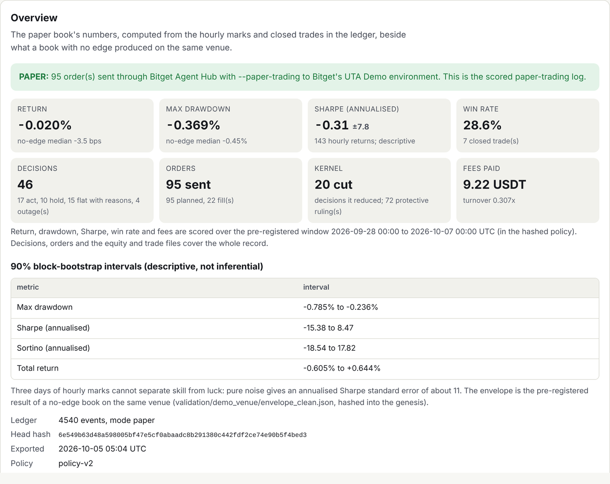
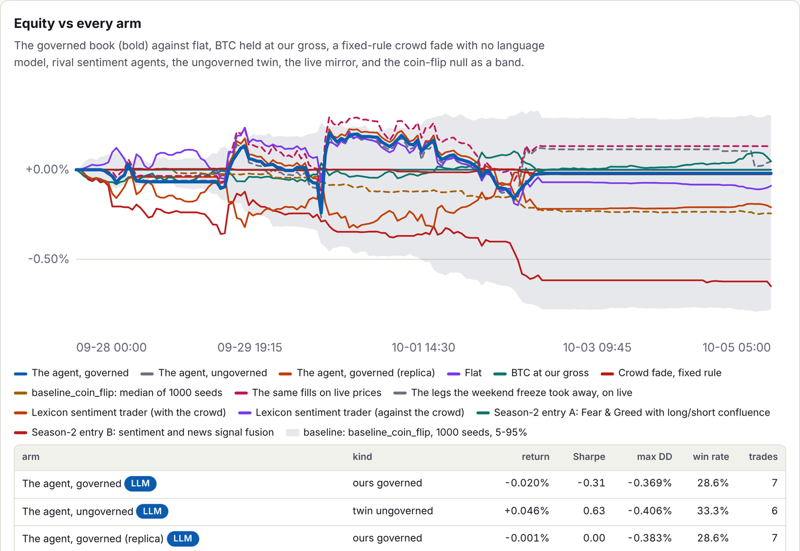
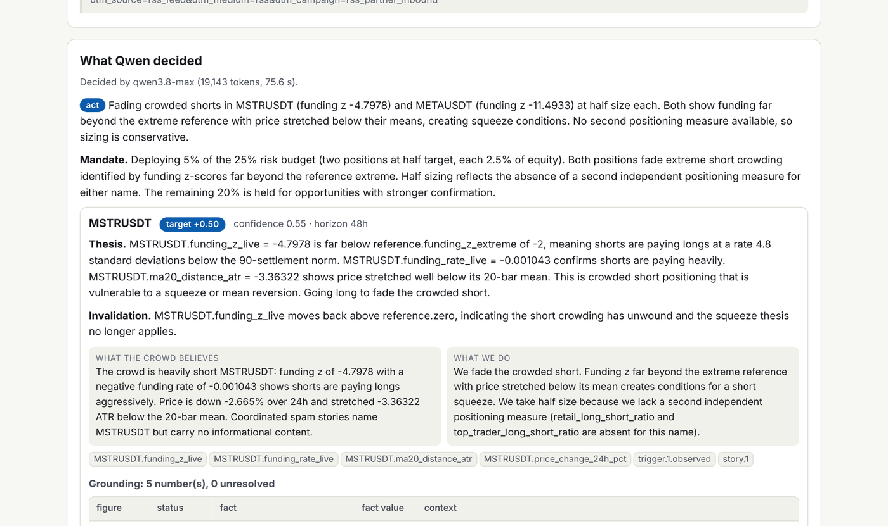
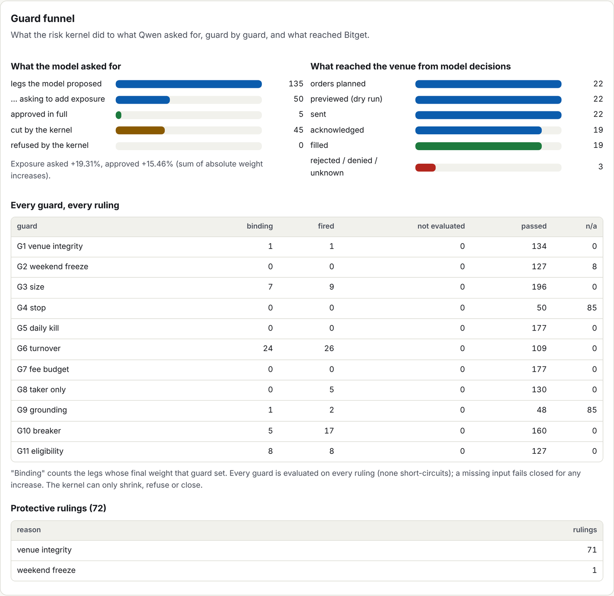
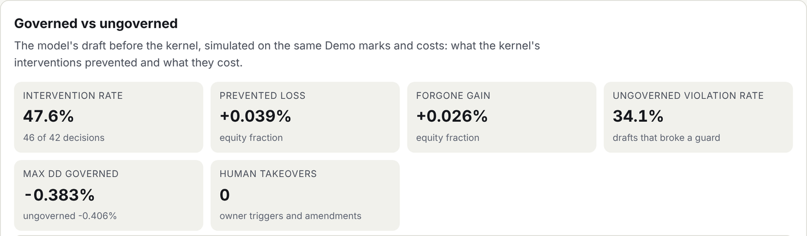

# t2-sentiment-agent

**Qwen decides. A risk kernel that can only reduce stands between it and the venue. Bitget's own
Agent Hub places every order on Bitget Demo. One hash-chained log proves all of it.**

A Market Sentiment Agent for Bitget AI Base Camp S2, Track 2 (Agentic Trading). It reads what the
crowd is doing on 14 Bitget perpetuals (funding against its norm, long/short skew, open interest,
taker flow, Fear & Greed, news and screened social text), and `qwen3.8-max` decides the whole book
at once: fade a crowded trade, hedge, cut, or stay flat with written reasons. Every target carries a
thesis, an invalidation tied to a logged fact, and "what the crowd believes vs what we do". Nothing
deterministic ever adds exposure.

**[Open the live record](https://t2-sentiment-agent-run2.vercel.app)** — every decision card, the
kernel's ruling guard by guard, the venue order ids, and the same model ungoverned beside it ·
**[Proof deck](https://t2-sentiment-agent-run2.vercel.app/deck.html)**, sixteen slides of evidence ·
**[Whitepaper](https://t2-sentiment-agent-run2.vercel.app/whitepaper.html)**
([Markdown](WHITEPAPER.md)) · [Design](DESIGN.md) · [Runbook](RUNBOOK.md)



---

## The record, in numbers

Run 2, Bitget UTA Demo, pre-registered window 2026-09-28 00:00 to 2026-10-07 00:00 UTC. Figures are
the 2026-10-05 05:04 UTC export; the page republishes hourly from the log and
`scripts/recompute.py` rebuilds every one.

| | |
|---|---|
| Decisions by the model | **46**: 17 act, 10 hold, 15 flat with reasons, 4 model outages in which no rule traded in its place |
| Orders through Agent Hub | **95** sent to Bitget Demo, each previewed with `--dry-run` first; 22 fills, 7 closed trades |
| Return / max drawdown | **−0.02% / −0.37%**; 90% bootstrap band −0.61% to +0.64%. Nine days of hourly marks cannot separate skill from luck, and the page says so on every metric |
| Sharpe (annualised) / win rate | −0.31 ± 7.8 / 28.6% on 7 trades, labelled descriptive |
| What the kernel did | changed **20** decisions (46 legs cut); 72 protective rulings; **0 human takeovers** |
| The same model, ungoverned | **34.1%** of its drafts broke a guard; the kernel's cuts prevented 0.039% of equity in losses and forwent 0.026% in gains |
| Fixed-rule crowd fade, no model, same clock | **−0.65%** on 69 trades |
| Coin flip, 1,000 seeds, same venue | median **−0.24%**; the governed replica beat 76.4% of seeds |
| Rival sentiment agents, same snapshots, same simulator | lexicon trader −0.21% (with the crowd) and −0.09% (against it); a Season-2 sentiment-fusion entry −0.03%; a Season-2 Fear & Greed entry never traded |
| Same fills marked at live prices | **+0.13%**; largest hourly Demo-to-live gap 8.5bps |



The quantitative half of the score is flat and we say so. What the record shows is the half that is
hard to fake: a model that stood aside 15 times with reasons, a kernel that cut a third of the
drafts that would have broken a rule, nothing added by any deterministic code, and every line
reproducible from the log.

## One decision, start to finish

Card [`dec-c8701963…`](https://t2-sentiment-agent-run2.vercel.app/cards/dec-c8701963b5930c3551aec635d15abaa7.html),
2026-09-28 06:08 UTC, the first trade of run 2:



- **Trigger:** `funding_zscore:MSTRUSDT`, z −4.86. The sources that answered and those that did not
  are listed; 419 text items were shown, 1 withheld by quarantine.
- **Qwen (19,143 tokens, 75.6 s):** act. "METAUSDT.funding_z_live = −11.49 is extraordinarily far
  below the extreme reference of −2 … the most crowded short in the universe and the most
  vulnerable to a squeeze." Invalidation: "funding_z_live moves back above reference.zero". Half
  size on both names "because we lack a second independent positioning measure". Grounding: 5
  numbers, 0 unresolved.
- **Kernel:** all eleven guards evaluated, approved as asked, 2.5% each.
- **Agent Hub:** the `bgc order place --dry-run` payload is shown; then META buy 1.70, `clientOid`
  `sa37bb5d…`, venue `orderId` `1488348258885812225`, filled 732.53, stop 703.23; MSTR buy 7.92 →
  `1488348265357623297`, filled 157.64.
- **Outcome:** closed by the model at 16:06 for −24.04 and −9.75 USDT. A losing trade, fully
  accounted for, with the ledger rows and blob hashes that prove each line.

Two more worth opening: [`dec-c43080e5…`](https://t2-sentiment-agent-run2.vercel.app/cards/dec-c43080e5a4afca5ca919bd80a5f69bab.html),
flat with reasons ("coordinated social clusters are all promotional spam … one withheld item
carried a prompt injection attempt; noted as market noise, not acted upon"), and
[`dec-e69542…`](https://t2-sentiment-agent-run2.vercel.app/cards/dec-e69542572a444cb30a4bd5ae3768e2b9.html),
where the model asked for 17.3% gross and G3 scaled the new legs by 0.5456 with the arithmetic in
the ruling.

## Verify it in 60 seconds

No install for the first two; plain Python for the third.

```bash
R=https://t2-sentiment-agent-run2.vercel.app
# 1. The scored metrics and counts, computed from the log
curl -s "$R/summary.json" | jq '{scoring_window, metrics: (.metrics | {total_return, sharpe_ann, max_drawdown, win_rate, n_closed_trades}), counts}'
# 2. The genesis hash, and the ledger heads already confirmed in a Bitcoin block (OpenTimestamps)
curl -s "$R/genesis.json" | jq '{hash, bitcoin_confirmed: [.anchors[] | select(.record.status == "upgraded") | .seq]}'
# 3. Every signed head of the record, checked against the key committed here (git clone first)
python scripts/verify_heads.py "$R" validation/run2/signed_heads.json
```

The full check, every figure on the page recomputed from the log with the standard library alone:
`python scripts/recompute.py public/` against a downloaded copy of the site. Any recorded decision
re-runs without a key through the real kernel and must reproduce the logged ruling:
`t2sa replay --public public/ --decision <id>`.

## Event → decision → execution

```
market / crowd / calendar  ->  trigger (pre-registered cadences; cooldowns, daily cap)
        -> snapshot: every figure logged with its source and health; text quarantined and clustered
        -> Qwen decides the whole book: targets, thesis, invalidation, crowd vs us, or flat with reasons
        -> contract and grounding: every number resolves to a logged fact; confidence <= 0.5 cannot open
        -> risk kernel: 11 guards that can only shrink or refuse, each ruling logged per guard
        -> Agent Hub: `bgc --dry-run` preview, then the order on Demo with a preset stop
        -> reconciliation against the venue: fills, positions, stops, funding, equity
        -> hourly mark -> published record -> scripts/recompute.py
```

Each step is a ledger event. [DESIGN.md](DESIGN.md) specifies every module; [RUNBOOK.md](RUNBOOK.md)
is the operator's procedure, and `t2sa go-live` is the one command that starts or resumes a run.

## The kernel: eleven guards that can only reduce

The invariant is a type, not a convention. `InstrumentRuling` refuses to be constructed if the
approved weight exceeds the reference, turns its side, or changes without naming the guard that
bound it; the only object the executor accepts, `ApprovedOrder`, is minted by one function in
`kernel/approval.py`, and a source-scan test fails if its token appears anywhere else. Every guard
is evaluated on every ruling; none short-circuits; a missing input fails closed for any increase;
reductions are never blocked.

Each guard answers a failure of Bitget's Demo venue that was measured before the guard was written
(`validation/`), and `tests/contract/test_policy_evidence.py` fails if the policy drifts from the
measurement:

| Guard | Rule | The measurement behind it |
|---|---|---|
| G1 venue integrity | exit when Demo's mark is >3% from its index or its last is beyond the per-name p99 gap from live | a 65.6% Demo flash mark on BTCUSDT; 5.4% on BTCPERP |
| G2 weekend freeze | equity and index legs flat Friday 20:00 → Monday 00:00 UTC | Demo's equity perps move 0.1–1.5bps an hour at weekends while live moves 5.6–29 |
| G3 size | ≤5% a name, ≤25% gross, ≤10% net, crypto-beta names ≤7.5% together | a no-edge 25%-gross book's worst drawdown was −2.48% |
| G4 stop | a venue stop on every opening, the wider of 4% and twice the p99 gap | HOOD 7.66%, MSTR 6.32% |
| G5 daily kill · G6 turnover · G7 fee budget | −1.5% a day flattens; 2 orders a name a day, 24h minimum hold; no new exposure past 7bps a day in fees | the envelope; taker 0.06% on all 14 |
| G8 taker only · G9 grounding | no opening above a 20bps spread; an ungrounded number cannot add | Demo spreads 0.1–6.6bps |
| G10 breaker · G11 eligibility | drawdown 2.5% → reduce-only, 4% → halt; stale data cannot open; venue minimums and splits | the envelope; `universe_probe.json` |





In run 2 the guards bound 46 legs on 20 decisions (G6 24, G11 8, G3 7, G10 5, G1 1, G9 1), a
forced exit fired on an 80bps Demo-live gap, and a venue stop fired on the MSTR short on 2 Oct.

## Pre-registered, chained, signed, anchored

Before the first decision, a genesis (hash `fb66b6bf…`, 2026-09-28 00:07:44 UTC) committed the
policy, the three prompt files, the code commit, both lock files, the universe, the eight metric
definitions, the scoring window and the expected no-edge envelope, and was posted on X before the
first order. Run 2 declares every change against run 1: nine code and prompt fixes (d1–d9) and
eight policy amendments (a1–a8), each with its evidence and a test that it changes only what it
declares; an undeclared policy change is refused at start-up.

Every event is hash-chained (4,540 at the export). Twelve ledger heads are Ed25519-signed against
`keys/ledger_signing.pub`; daily heads go to OpenTimestamps, and six already carry a Bitcoin block
attestation. Run 1 (2026-09-24 to 09-27) stays published as it closed at
https://t2-sentiment-agent-live.vercel.app.

## Bitget's toolkit, used and measured

| Surface | Used for | Measured |
|---|---|---|
| **Agent Hub `bgc`** (pinned 3.0.0) | the only order path: `order place --dry-run` then `order place`, `order detail` / `fills` / `history`, `position info`, `strategy_order` for stops, `account_overview`, and the live-negative check in the environment proof | 14 verbs, 13 healthy in the last probe |
| **Bitget public v3 market API** | funding, open interest, long/short, taker ratio, candles, books; Demo reads carry `paptrading: 1` | 7 endpoints, 5 healthy |
| **`bitget-signal`** (MCP) | the first source for Fear & Greed, long/short, taker ratio, open interest, Reddit trending, news | 7 tools wired; **0 answered** in run 2, logged as failed; read from the upstreams each tool names, on a labelled surface |
| **`bitget-mcp-server`** | the first source for crypto futures positioning, the equity calendar and insider filings | 11 entries wired; 1 healthy; every `do_query` 503 or "Session not found" from 3 Oct |
| **Agentic account** | not used, with the reason on the page: it trades live funds, and Track 2 runs on a Demo key | |
| **GetAgent Playbook** | a signal-only replica of the policy is built (`playbook/`, parity tests); not published, as it needs the `llm_bounded` runtime | |

The coverage matrix on the page lists all 134 surfaces, used or not, with the reason; feed health
lists every failing source since when.

## Safety model

- Orders go only to Bitget's Demo environment. Every argv the transport can build carries
  `--paper-trading`; the agent proves the key is a Demo key before the first order (accepted by Demo,
  refused by live with 40099), and exits on 40099 at any later point.
- Credentials are read from one place, `.secrets/demo.env` (git-ignored), and passed only to the
  Agent Hub child process, whose environment is built from scratch.
- Tests never touch the network, never start a child process other than Python, never see a
  credential and never call the model; `tests/conftest.py` makes each of those a failure.
- A model outage is not a decision: no rule trades in its place, and the book is flattened on the
  third failed decision in a row.

## Honest limits

- **The return is zero within noise:** −0.02% with a band of ±0.6%, seven trades, a Sharpe band from
  −15 to +8. Nine days is not a track record.
- **Both Bitget data services were down for the whole run.** The crowd view came from the upstreams
  they wrap; the toolkit matrix reports 0 of 7 and 1 of 11.
- **The red team is built and tested, not run on this export.** It injects the HeyArka and AgentDojo
  attack strings and a coordinated pump into recorded snapshots and grades every arm; it calls Qwen
  and runs only under an approved token budget, so the page says "not computed".
- **72 of the 95 orders are venue rejections of one protective exit:** Bitget Demo refused the same
  META close every five minutes for six hours (`METAUSDT_UMCBL does not exist`); the model closed
  the position itself at 16:06. The model-initiated count is 22 orders, 19 filled.
- **The genesis's own OpenTimestamps stamp failed** on a client bug and is recorded as failed;
  later heads are anchored.
- Two rivals (a finBERT-weighted trader, a TradingAgents-style chain on Qwen) are built and not run,
  and the Playbook replica is built from policy-v1, not the scored v2.

## Run the checks

```bash
pip install -e ".[dev]"
python scripts/check_all.py            # ruff, ruff format, mypy --strict, pytest (2,996 tests)
```

## Layout

See [DESIGN.md](DESIGN.md): architecture, data flow, every guard and its measured basis, the event
triggers, the file layout and the module specifications. The measurements behind the policy are in
[`validation/`](validation/README.md); the rival agents and their licences in
[`src/sentiment_agent/rivals/RIVALS.md`](src/sentiment_agent/rivals/RIVALS.md); the demo video
script in `scripts/record_video.py`.

## Licence and attributions

MIT (see [LICENSE](LICENSE)). Parts are ported from the author's ARGUS project, also MIT; third-party
material and what was taken from it are listed in [NOTICE.md](NOTICE.md).
